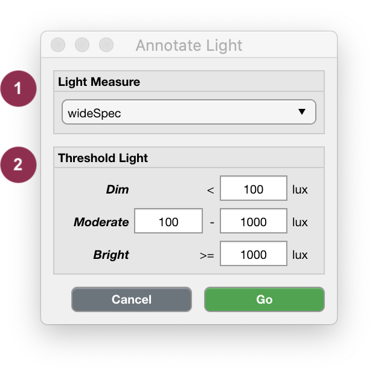

.. _analysis-annotate-light-top:

==============
Annotate Light
==============

As opposed to Annotation of Acceleration Metrics, Cicada uses a most simplistic thresholding method for Annotating Light Metrics. Each and every epoch is checked between 2 thresholds, if it is lower than ``100`` lux, it is labeled as ``dim``, if it is between ``100`` and ``1000`` lux, is it labeled as ``moderate``, and if it is greater than or equal to ``1000`` lux, it is labeled ``bright``.

**To Annotate Light Metrics,**

- click ``Analyse`` > ``Annotate Epochs`` > ``Annotate Light``.

    Light Annotation.

1. Select which Light Metric you want to use to Annotate the Epochs.
2. 'Low', 'Moderate' and 'Bright' light exposure levels are defined by these default thresholds.

.. note::

    **Reference:** Dautovich, Natalie D., et al. "A systematic review of the amount and timing of light in association with objective and subjective sleep outcomes in community-dwelling adults." Sleep health 5.1 (2019): 31-48.