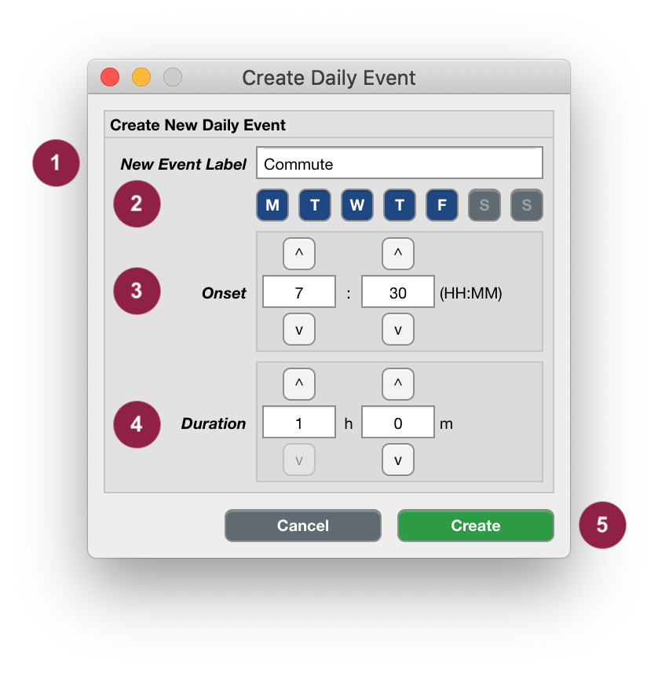
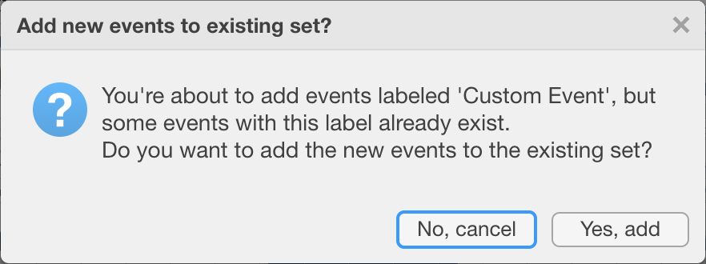
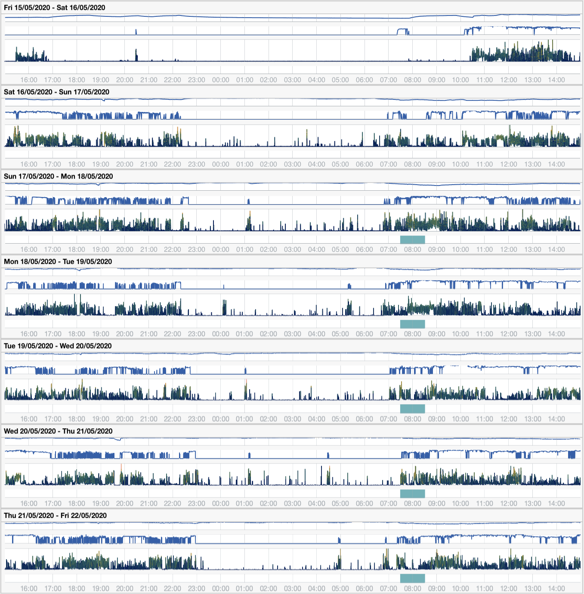

.. _analysis-daily-events-top:

==========================
Create Custom Daily Events
==========================

You may want to analyse the same part of the day, for all of the days in the recording. For example, you may have instructed your participants to excersize at a certain time of the day, or use a light-therapy wake-up lamp in the morning, or you might be interested in segments of the morning and afternoon when your participant commuted to work. We'll use the latter as an example now. The participant indicated to leave for work on Monday to Friday at 7:30 am and it takes about an hour to get to work. Let's create Daily Events for these segments.

**To create daily Events,**

- click ``Analyse`` > ``Events`` > ``Create Daily Events``.

1. Indicate an Event Label that is short, specific and informative, e.g. ``Commute``.

.. Note::

    In case you specified a new Event label that is used by Cicada, you'll see the error message 'Can't use Cicada's proprietary labels'. These labels are 'start', 'button', 'reject', 'sleepwindow', 'sleepperiod', and 'waso'.

2. Use the toggle buttons to select on which days this Event should be created, e.g. all weekdays.
3. Use the up ``^`` and down ``v`` buttons, or type numeric values in the input fields, to indicate the onset of the Events, e.g. 7:30.
4. Use the up ``^`` and down ``v`` buttons, or type numeric values in the input fields, to indicate the duration of the Events, e.g. 1h 0m. Note that the Event duration must be a positive non-zero value.
5. Click ``Create`` to create the Daily Events, or use ``Cancel`` to abort.

    In case you specified a new Event label that already exists, a question dialogue will ask you to confirm that you want to add the new events to the existing set.

    The new Custom Events are shown in the Event axes as turquoise bars every day at 7:30 to 8:30 am except for Saturday and Sunday (the first two panels in this example).

You can **edit** or **delete** any of the single Events you just created, e.g. if the Commute was different on one day. 

**To edit or delete a Custom Event,**

follow the instructions :ref:`in this section on how to edit events <overview-interface-edit-events>`.