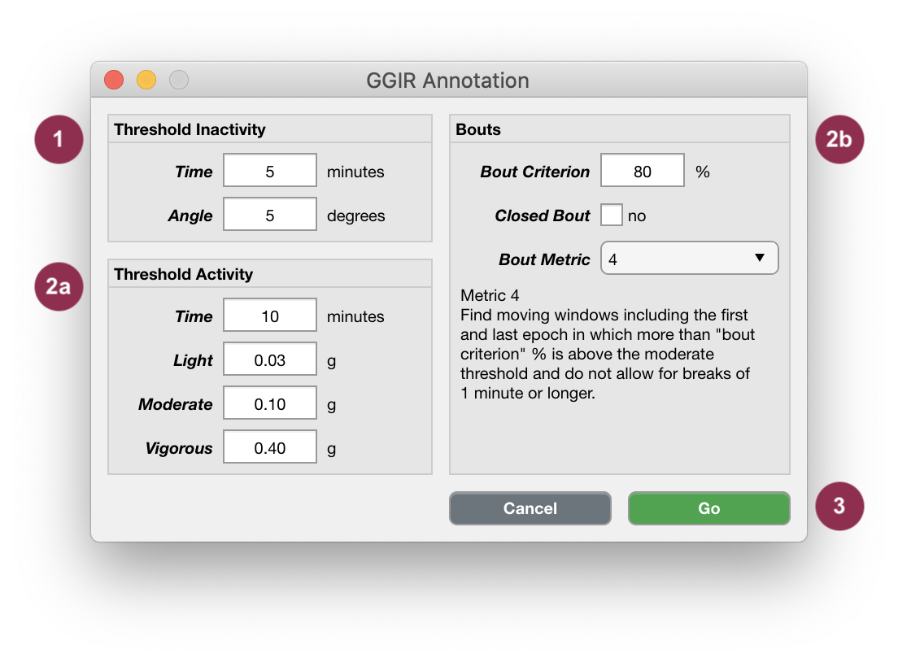

.. _analysis-annotate-acceleration-ggir-top:

================================
Annotate Acceleration Using GGIR
================================

Cicada uses an algorithm adapted from GGIR's ``identify_level.R`` function to annotate the Acceleration Metrics. First, the user has to specify a set of parameters. The 'activity treshold' (e.g. 0.10 g for 'moderate' activity) is used to identify Epochs in which the Acceleration Metric 'Euclidean Norm' is above 0.10 g. The parameters 'activity time' (e.g. 10 minutes) and 'bout criterion' (e.g. 80%) are then used to only keep those segments in which 80% of the Epochs within a 10 minute window are above 0.10 g. The entire segment is then labelled as 'moderate' activity. This is repeated for all activity levels. Any Epoch that has not met any of the criteria is labelled as 'low' activity. This way, each and every Epoch has an Annotation label.

**To Annotate Acceleration Metrics with GGIR,**

- click ``Analyse`` > ``Annotate Epochs`` > ``Annotate Acceleration (GGIR)``.

    Accelerometry Annotation Using GGIR.

1. Sustained inactivity Epochs are defined as segments of at least ``5`` minutes in length where the consecutive change in the ``Angle`` Metric is less than ``5`` degrees. Adapt these two parameters for more or less stringent criteria.
2. 'Low', 'Light', 'Moderate' and 'Vigorous' activity Epochs are defined by any of the 4 algorithms described below.

.. note::

    **Bout Metrics**

    1. The algorithm starts by finding the first epoch above the threshold. Then, it checks if the subsequent ``10`` minute segment contains at least ``80`` % epochs above the threshold. If FALSE, it skips to the next epoch that is above the threshold and starts again. If TRUE, (1) it expands the segment iteratively, one epoch at a time, until it contains not less than ``80`` % of epochs above the threshold, (2) it crops the segment from the first until the last epoch above the threshold, and (3) assigns the activity-level label for that segment. Next, it searches for the next epoch above the threshold after the identified segment, and starts again. If ``boutClosed`` is ``false``, only the epochs above the threshold within the segment are assigned the activity-level label. If ``boutClosed`` is ``true``, the entire segment is assigned the activity-level label.
    2. For each epoch above the threshold, it checks if the subsequent ``10`` minute segment contains at least ``80`` % epochs above the threshold. If FALSE, it continues to the next epoch that is above the threshold. If TRUE, the entire segment is assigned the activity-level label, and then it continues to the next epoch that is above the threshold (which could be within the segment that was just itentified).
    3. First, it finds intermediate segments between epochs above the threshold that are longer than 1 minute. These intermediate segments define the breaks between potential segments. The algorithm then calculates the percentage of epochs above the threshold for all potential segments using a ``10`` minute moving window. Any ``10`` minute segment that has at least ``80`` % of its epochs above the threshold is then assigned the activity-level label. This method does not allow breaks for more than 1 minute.
    4. Similar as 3, except for one additional rule. It assigns the activity-level label to any ``10`` minute segment that (1) has at least ``80`` % of the epochs above the threshold and (2) do not have breaks over 1 minute, but in addition also (3) starts and ends with an epoch above the threshold.