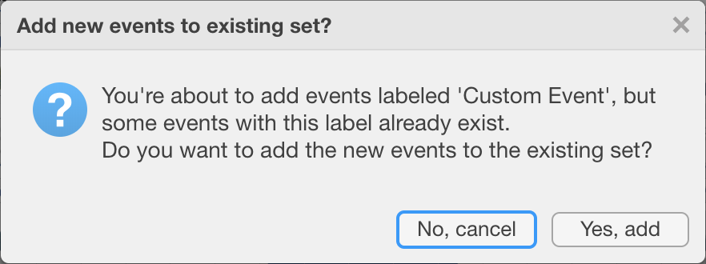

.. _analysis-relative-events-top:

=============================
Create Custom Relative Events
=============================

You may want to study segments that are before, during or after existing Events. For example, you may be interested in the activity levels prior to sleep so you can understand the impact of this presleep activity on various sleep variables. In this example we will create Custom Relative Events that start 3h 30m prior to each Sleep Window Event with a duration of 3h.

.. note::

    Before we can create Custom Events that are relative to Sleep Window Events, we first have to :ref:`create Sleep Window Events <overview-pipeline-sleep-window-events>`.

**To create Relative Events,**

- click ``Analyse`` > ``Events`` > ``Create Relative Events``.

1. Select the Reference Event ``Label`` and ``Type``, i.e. select which Events you want to use to create the new Custom Events relative to. In this example we will select the ``sleepWindow`` Events imported from a ``sleepDiary``.
2. Use the radio-buttons to select whether the new Custom Events should be relative to the ``onset`` (start) or ``offset`` (end) of the Reference Events, e.g. ``onset`` in our example.
3. Define a short, specific and informative Event label for the new Custom Events, e.g. ``Presleep Activity``.

.. Note::

    In case you specified a new Event label that is used by Cicada, you'll see the error message 'Can't use Cicada's proprietary labels'. These labels are 'start', 'button', 'reject', 'sleepwindow', 'sleepperiod', and 'waso'.

4. Specify the ``delay``, i.e. the difference between the onset of the new Custom Events and the onset/offset of the reference Events, e.g. ``-3h 30m`` in our example. Click the ``sign`` button to switch between positive and negative delays, and use the ``^`` up and ``v`` down buttons or directly type in the input fields to specify the delay hours and minutes.
5. Specify the ``duration`` of the new Custom Events, e.g. ``3h 0m`` in our example. Note that the Event duration must be a positive non-zero value.
6. Click ``Create`` to create the Relative Events, or use ``Cancel`` to abort.

    In case you specified a new Event label that already exists, a question dialogue will ask you to confirm that you want to add the new events to the existing set.

    The new Custom Events are shown in the Event axes as turquoise bars, 3h 30m prior to each Sleep Window Event with a duration of 3h.

You can **edit** or **delete** any of the single Events you just created.

**To edit or delete a Custom Event,**

follow the instructions :ref:`in this section on how to edit events <overview-interface-edit-events>`.