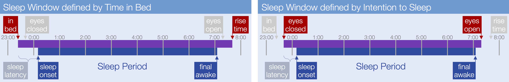
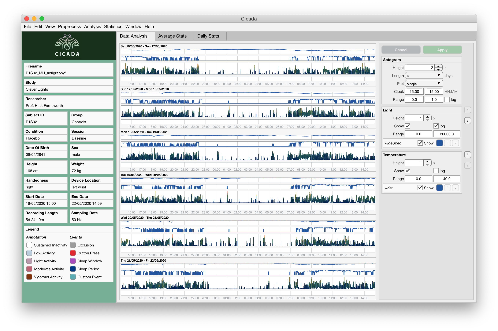
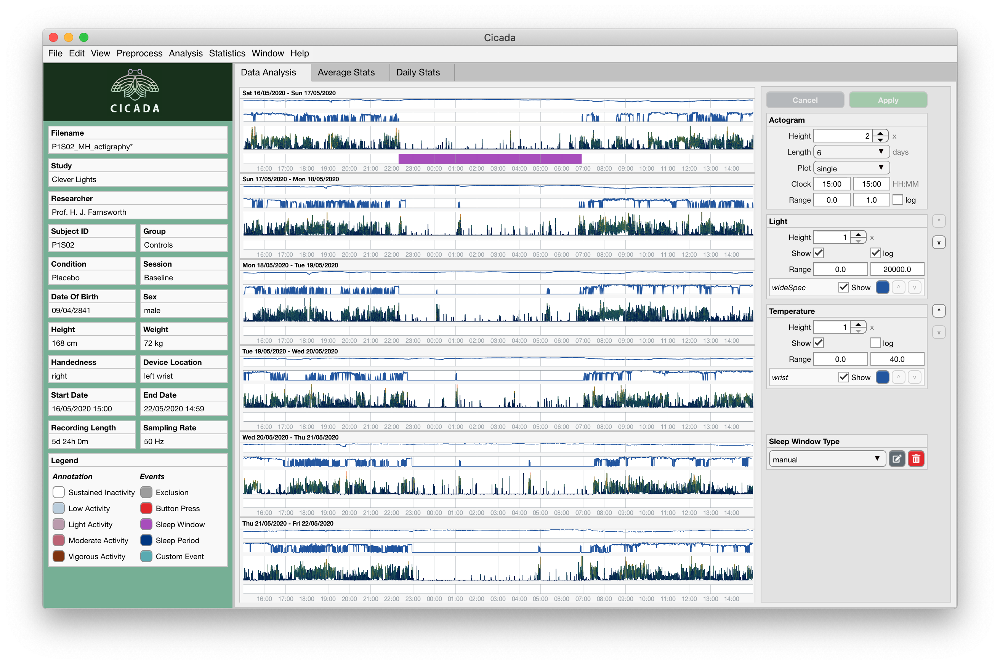
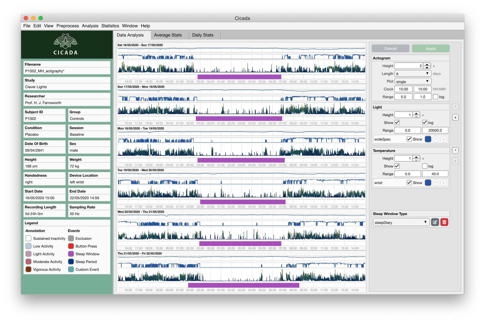
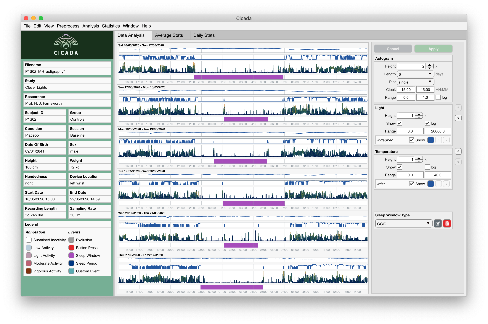
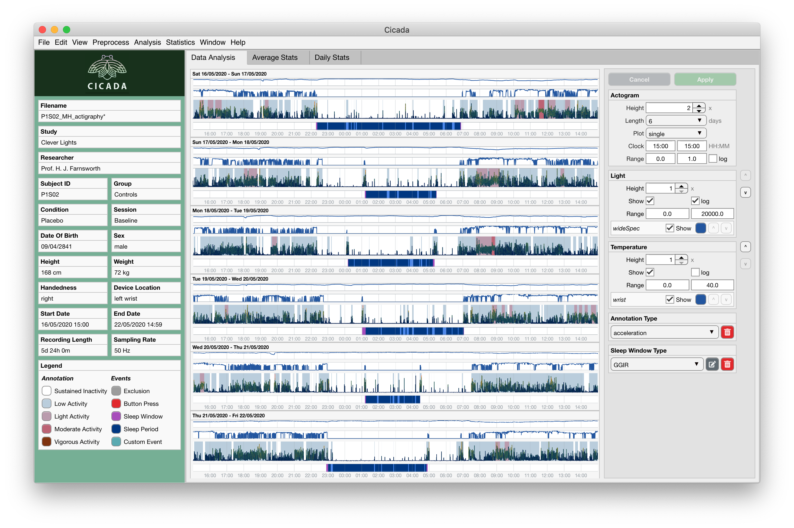
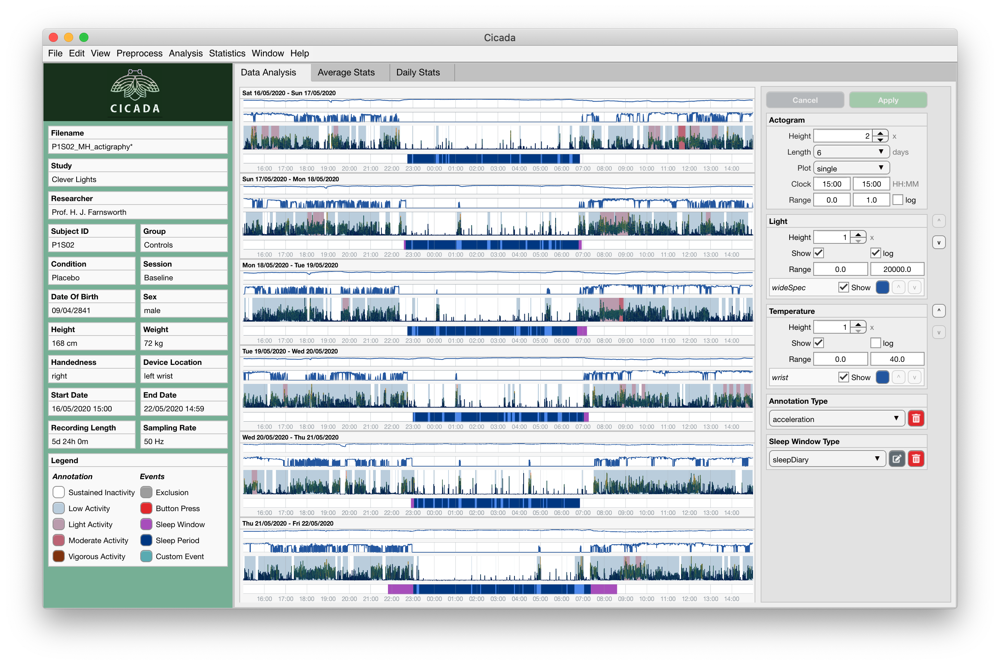

.. _analysis-sleep-top:

==============
Sleep Analysis
==============

**This page provides the complete and in-depth outline of the various ways you can perform sleep analysis in Cicada.**

Introduction
============

The aim of sleep analysis is to identify 'Sleep Windows', 'Sleep Periods', and 'WASO' events. 

Sleep Window
------------

The **Sleep Window** is a time period in which the participant has the opportunity to sleep (this period is sometimes also referred to as the Sleep Opportunity Window). *There are 3 possible types of Sleep Window Events, which we will discuss below*.

1. **manual**, by creating new events using the cursor,
2. **sleepDiary**, by importing a sleep diary, or
3. **GGIR**, by using the GGIR Sleep Detection algorithm,

.. note::

    When you import a sleep diary, there are two possible ways to define the Sleep Window, (1) as the *time spent in bed* (in bed until rise time), or (2) the when the participant turned off the lights and shut their eyes with the *intention* to sleep (eyes closed until eyes open). It is up to you as the researcher to decide what applies best to your research question. Your choice affects the value of any sleep variable that is derived from the Sleep Window and Sleep Period, e.g. do you want sleep latency to be relative to the *time in bed* or to the time the participant *intended* to sleep?

Sleep Period
------------

The **Sleep Period** is a time period, *within* the Sleep Window, in which the participant is asleep, excluding 'wake-after-sleep-onset' events, i.e. the period between sleep onset until final awakening. *There are 2 possible types of Sleep Period Events*.

1. **actigraphy**, defined as the period, *within* the Sleep Window, between the first and last epoch annotated as 'sustained inactive', i.e. less than 5 degrees of change in the angle of the actigraph for at least 5 minutes of time (default settings).
2. **sleepDiary**, defined as the period between the subjective estimate of sleep onset and final awakening. 

.. note::

    Most types of sleep diaries ask the participant to estimate the sleep onset latency, but some ask the sleep onset clock time directly. Cicada expects to calculate the sleep onset clock time based on the ``lights out`` clock time and ``sleep onset latency`` in minutes. So, if ``sleep onset latency`` is not directly available, the researcher must calculate it before importing the sleep diary.

WASO
----

The 'wake-after-sleep-onset' events are any period, *within* the Sleep Period, where the participant is awake. *There are 2 possible types of WASO events*.

1. **actigraphy**, defined as all the periods, *within* the Sleep Period, where one or more epochs are *not* annotated as 'sustained inactive'.
2. **sleepDiary**, defined by the subjective estimate of the number of awakenings (*N*), and total time awake (*T*), such that there are *N* events, each with a duration of *T/N*.

.. note::
    
    The 3 types of Sleep Window Events and the 2 types of Sleep Period and WASO events can co-exist in the Dataset, however it is up to the researcher to decide which Sleep Window Type should be used to define Sleep Period and WASO events.

.. note::

    The Sleep Period and WASO events of type ``actigraphy`` are shown in the 'Data Analysis' Tab. The Sleep Period and WASO Events of type ``sleepDiary`` are *not* shown in the 'Data Analysis' Tab, but are instead shown in the 'Sleep Stats' Tab alongside the Events of type ``actigraphy`` for comparison. We'll discuss that later.

Create Sleep Windows
====================

For this example, we will start with an example Dataset that is just imported, i.e. none of the analysis steps have been performed yet.

    **A brand new recording without any analysis steps.**

**To manually create Sleep Window Events,**

1. Left-click anywhere within the data panel to indicate the **onset** or **offset** of the Sleep Window. A pink cursor will appear with a label showing the time in ``HH:MM``.
2. Optionally, adjust the location of the cursor by pressing the ``left`` or ``right arrow`` keys on your keyboard.
3. Lock-in this timepoint by pressing the ``enter`` key. The cursor will now appear in blue color.
4. Again, left-click anywhere within the data panel and adjust using the ``arrow`` keys. If this second timepoint (pink) is *after* the first timepoint (blue) then the first timepoint marks the Sleep Window **onset** and the second marks the **offset**; and *vice versa*.
5. If you're unhappy about your selection
    - press the ``escape`` or ``backspace`` key on your keyboard, all cursors will disappear, go to step 1.
6. If you're happy about your selection
    - Press the ``enter`` key, the selection will now appear as a blue rectangle.
7. The 'Create New Event' interface appears, and use the 'Event Label' dropdown menu to select ``Sleep Window``. Click ``Create`` to confirm, or ``Cancel`` to abort.

    **Manually created Sleep Window Event.** 

Cicada has now added an Event to the table in ``ACT.analysis.events`` with the label ``sleepWindow`` and type ``manual``. The event is displayed in the Data Analysis Tab as a purple bar. Also note that a new panel appeared in the Settings Panel, titled 'Sleep Window Type'. The value in the dropdown menu is ``manual``, which indicates that Cicada will use manually defined Sleep Windows to define Sleep Period Events.

**To create Sleep Window Events based on a sleep diary,**

follow the instructions :ref:`in this section on how to import a sleep diary <file-import-sleep-diary-top>`.

    **Sleep Window Events from sleep diary.**
    
Cicada has now added all Sleep Window Events from the sleep diary. Note that the 'Sleep Window Type' value in the Settings Panel has now changed to ``sleepDiary``. The ``manual`` Sleep Window that we created earlier still exists in the Dataset, it's just not shown.

**To create Sleep Window Events using GGIR's sleep detection algorithm,**

1. click ``Analyse`` > ``Events`` > ``GGIR Sleep Detection``.

.. Note::

    The GGIR sleep detection algorithm is designed to detect Sleep Windows by identifying the largest segment in the *analysis window* in which the median absolute deviation of the angle is below 15 times its 10th percentile. The analysis window is defined by the Actogram start and end clock times shown in the settings panel. Cicada uses an emperically derived default analysis window of '15:00' until '15:00' the next day. It is highly unlikely, under normal circumstances, that a Sleep Window begins before 15:00 and ends after 15:00. *However, depending on your sample, e.g. shiftworkers, youth or sleep disorders, you may want to adjust this analysis window*.

    **GGIR Sleep Window Events.**

Create Sleep Periods
====================

So far, we have created all 3 types of Sleep Window Events. But there are no Sleep Period and WASO events yet. That is because Cicada did not have access to the Acceleration Annotation yet. Please recall that a Sleep Period is defined as the period, *within* the Sleep Window, between the first and last epoch annotated as 'sustained inactive'. So, we have to Annotate the Acceleration Metrics to define those 'sustained inactive' segments.

**To Annotate Acceleration Metrics with GGIR,**

1. click ``Analyse`` > ``Annotate Epochs`` > ``Annotate Acceleration (GGIR)``,
2. Confirm and or adapt the default algorithm parameters,
3. Click ``Go`` to start the Annotation, or ``Cancel`` to abort.

:ref:`Read more about Annotating Acceleration data... <analysis-annotate-acceleration-ggir-top>`

    **Sleep Period and WASO events shown if Annotation of Acceleration Metrics is available.**

Cicada will automatically create Sleep Period and WASO events each time you define a Sleep Window *and* Annotation of Acceleration is available, *or* when you Annotate the Acceleration *and* at least one Sleep Window is defined. The Sleep Period Events are shown in the 'Data Analysis' tab as blue bars, the WASO events are shown as light blue bars. Note that the onset and offset of the Sleep Period conincides with the first and last epoch, *within* the Sleep Window, annotated as 'sustained inactive'. Also note that a new panel appeared in the Settings Panel, titled 'Annotation Type', where you can delete the Annotation.

When we inspect the Sleep Window Events of type ``GGIR``, you can appreciate that they do not align very much with what the Sleep Windows should be. This likely due to the frequent increased activity segments throughout the night. *Especially if your sample consists of participants with sleep disorders, the GGIR sleep detection algorithm may not be the most appropriate way to define Sleep Windows*.

Cicada will use the Sleep Windows of the type that is shown in the Sleep Window Type panel to define Sleep Period and WASO events. 

**So we should change the Sleep Window Type,**

1. Select the appropriate Sleep Window Type from the dropdown menu, i.e. ``sleepDiary`` for this example,
2. Click on the ``Apply`` button to confirm, or ``Cancel`` to abort.

    **Cicada has changed the Sleep Window Events to type 'sleepDiary'**, and it also automatically re-calculated the Sleep Period and WASO events.

However, still we can appreciate that the last Sleep Window does not align very well with what it should be. It seems that the ``lights off`` clock time should be an hour later, and the ``lights on`` clock time should be an hour earlier. Lets edit this.

Edit Sleep Windows
==================

**You can only edit Sleep Window Events of type** ``manual``, you cannot directly edit Sleep Window Events of other types. The reason for this is to maintain the original data integrity and to ensure repeatability of analysis pipelines. Furthermore, you cannot edit Sleep Period and WASO events as they are defined by the data.

So, in order for us to change the Sleep Window Events of type ``sleepDiary``, we must first convert them to type ``manual``.

**To convert a group of Sleep Window Events to** ``manual``,

1. In the Sleep Window Type panel (settings panel), select ``manual``.
2. Click the ``edit`` button indicated by the pencil-and-paper icon.

.. warning::

    Aha, I have set you up for failure. If you have followed this example, you will see the error message 'Cancelled: cannot copy the set of sleep windows of type 'sleepDiary' to the 'manual' set because at least one pair of those windows overlap.

Remember that we manually created a Sleep Window Event at the start? This event shares overlap with one of the Sleep Window Events of the sleep diary, and this is not allowed. So, we first have to delete this particular ``manual`` Sleep Window, and then copy the Sleep Windows from the sleep diary to the ``manual`` type.

**To delete the manual Sleep Window,**

1. Select ``manual`` in the Sleep Window Type panel,
2. click ``Apply``.
3. Click anywhere in the Events axis between the onset and offset of the Sleep Window Event to open the 'Edit Event' interface, or simply delete the entire Sleep Window group by clicking the ``delete`` button in the Sleep Window Type panel indicated by the trash icon.
4. In the confirmation dialogue, click 'Yes, delete'.

Now we're ready to copy the ``sleepDiary`` Sleep Window events to the ``manual`` set.

1. Select ``sleepDiary`` in the Sleep Window Type panel,
2. click ``Apply``,
3. Click the ``edit`` button indicated by the pencil-and-paper icon.

Nothing apparent changed in the 'Data Analysis' Tab, the same Events are shown, however, the Events are now of type ``manual`` as is shown in the Sleep Window Type panel. Now we can change any Event we like.

**As before, to edit an Event,** left-click on the event of interest in the data analysis panel, and follow the 'Edit Event' interface.

.. note::

    In this last example, we did not actually change the Sleep Window of type ``sleepDiary``, we just changed a copy of that event. In the sections on 'Sleep Statistics' you'll see that Cicada compares sleep variables based on Actigraphy with those from the sleep diary, the latter thus being unchanged. If you suspect that the times reported by the participant are not correct, you must edit these values in the sleep diary data file.

Fantastic, have a cookie before you continue
--------------------------------------------