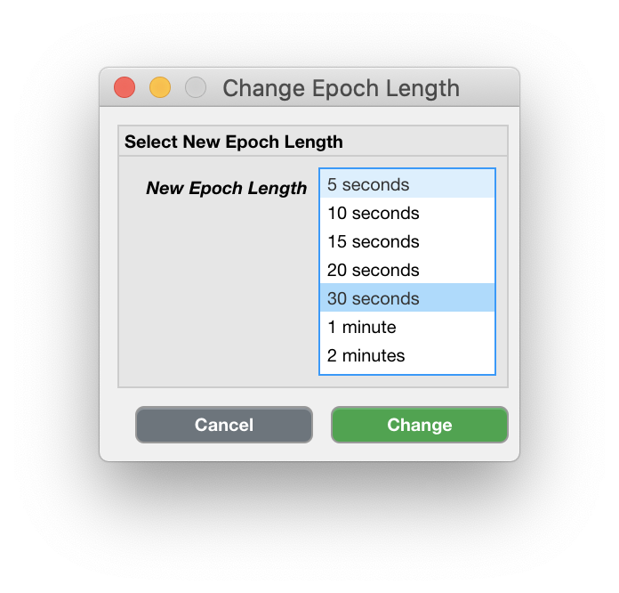

.. _edit-change-epoch-length-top:

===================
Change Epoch Length
===================

The default Epoch length that is used to calculate Metrics in a common timeframe is 5 seconds, which is suitable for most use-cases. However, your study may use devices that require a different Epoch length.

**To change the Epoch length,**

- click ``Edit`` > ``Change Epoch Length``.

    Scroll throught the list of 'New Epoch Lengths' and select the appropriate one. Click 'Change', or 'Cancel' to abort.