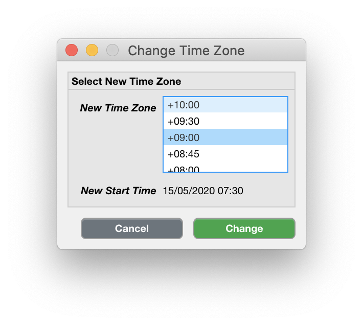

.. _edit-change-time-zone-top:

================
Change Time Zone
================

Often, the clock of the actigraph is synchronized with the clock of the computer that configured the device. In some cases, if the computer time is wrong, the recording may be in the wrong time zone. Alternatively, if the recording includes a shift in time due to e.g. daylight-saving regulations or travel, you can select the appropriate part of the Dataset and change the time zone.

**To change the time zone,**

- click ``Edit`` > ``Change Time Zone``.

    Scroll throught the list of 'New Time Zones' and select the appropriate one. The new start date of the recording is shown below. Click 'Change', or 'Cancel' to abort.