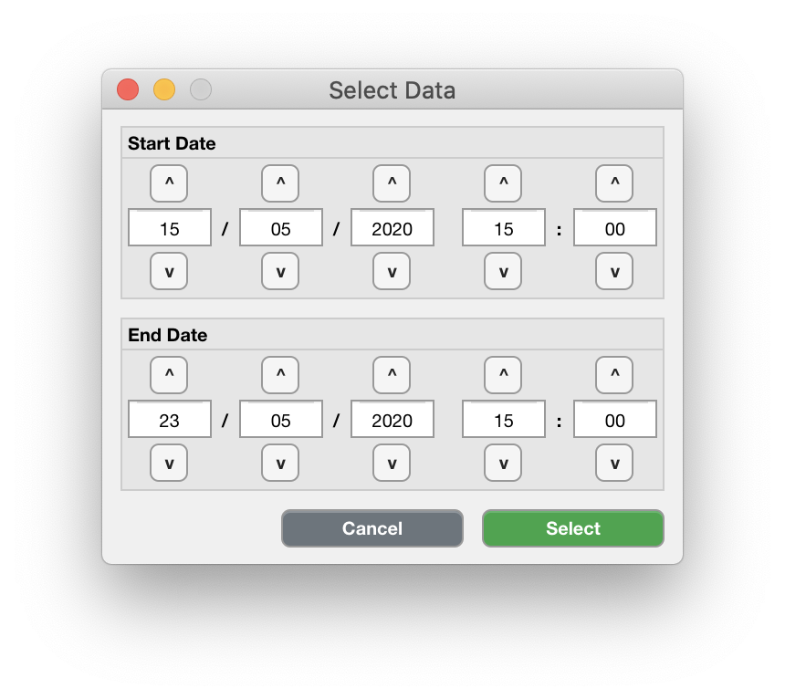

.. _edit-select-data-top:

============================
Select part of the recording
============================

Sometimes, the actigraph recording is started as soon as it is configured, and the device is then send by post to the participant and back to the institute. In such situations, you may want to select only that part of the recording where the participant actually wore the device.

**To select a part of the recording,**

- click ``Edit`` > ``Select Data``.

    Use the  up ``^`` or down ``v`` buttons or directly type integer values in the input fields to change the start date and time in the upper panel, and the end date and time in the lower panel. The date and time are formatted as ``dd/mm/yyyy HH:MM``. Click 'Select', or 'Cancel' to abort.