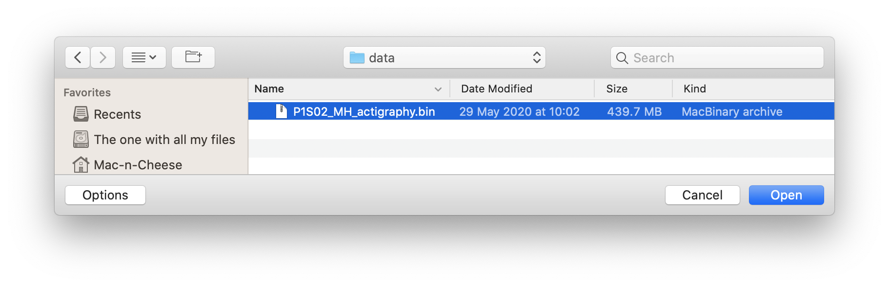

.. _file-import-actigraphy-top:

==============================
Import an Actigraphy recording
==============================

.. note::

    The only Actigraph that is currently supported in Cicada is the 'ActivInsight GeneActiv'. This is because I only had access to data from this device. Please, if you have raw data from another Actigraph, send me a de-identified copy so I can implement an import function for that device. Most appreciated.

**To import an Actigraphy recording,**

- click ``File`` > ``Import Actigraphy`` > ``Import GeneActive (.bin)``.

    A new browse window will open for you to select the .bin file to import. Navigate to your Raw Data file, select it, and click 'Open'. Click 'Cancel' to abort.

    Once the file is being imported, a dialogue window will show you the progress, and allows you to cancel the import. Depending on the size of your Raw Data file and computer specs, importing should take anywhere between 10-30 minutes. If you press the 'Cancel' button, you'll return to your previously open Dataset shortly. Otherwise, this is it, just wait.