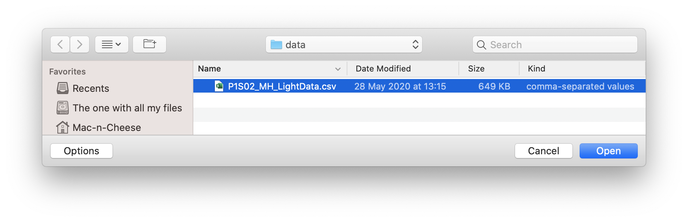
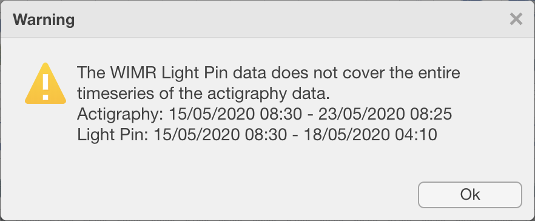
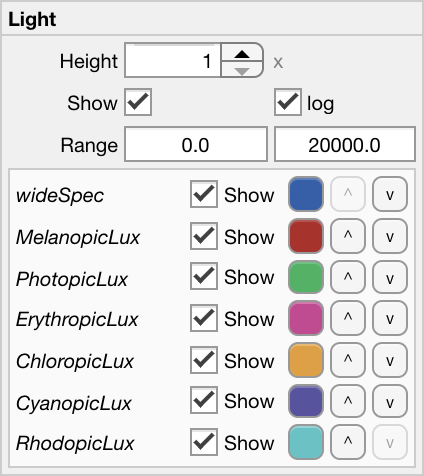

.. _file-import-other-data-top:

==========================================
Importing data from other wearable devices
==========================================

.. note::

    The only other wearable device that is currently supported in Cicada is an custom-built spectrometer. Again, please send me a de-identified copy of raw data from another device so I can implement an import function. Most appreciated.

WIMR Light Pin
==============

**To import Raw Data from a Light Pin Spectrometer developed at the Woolcock Instite, Sydney, Australia,**

- click ``File`` > ``Import Other Data`` > ``Import WIMR Light Pin (.csv)``.

    A new browse window will open for you to select the .csv file to import. Navigate to your Raw Data file, select it, and click 'Open'. Click 'Cancel' to abort.

    If the start and end time of the Light Pin recording does not completely match the start and end time of the Actigraphy recording, this message will appear to indicate what the difference in recording length is.

    The Raw Data has been imported in their raw format, i.e. sampling rate is 1/120 Hz, the Epoched Metrics are calulated as upsampled values, and the settings panel now shows all Metrics from where you can change the range, color, and order, and indicate which Metrics to show or hide.
    