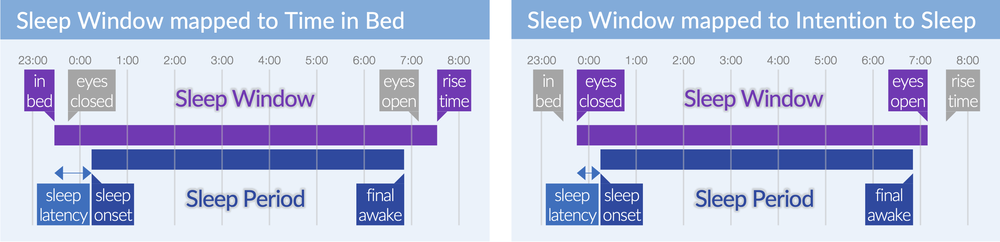

.. _file-import-sleep-diary-top:

====================
Import a Sleep Diary
====================

**To import a sleep diary,**

- click ``File`` > ``Import Events`` > ``Import Sleep Diary``.

**A sleep diary is imported in two main steps.**

1. Select the tabular Raw Data file, and inspect its contents
2. Specify how the Raw Data maps to 7 predefined variables, and inspect the to-be-imported data

First time to import a sleep diary
==================================

If this is the first time you import a sleep diary, the message below will appear and you'll have to create or locate a 'sleep diary import settings file'. This is a file that tells Cicada how to read your sleep diary data.

- If you already have a 'sleep diary import settings file', then you can use the 'Browse' button to locate it. The file you selected will then be used from now on.
- But, it is most likely that you don't have such a settings file yet.
    - To create one, click 'Create New'
    - Navigate to the Cicada installation location, e.g. 'C:\Program Files\Cicada' or '/Applications/Cicada'
    - Create a new folder named 'settings'
    - Create a new file with the name of the type of sleep diary you want to import, e.g. 'KarolinskaSleepDiary', or 'CarneyConsensusSleepDiary', click 'Save'.
    - The message below shows that this settings file will be used from now on.

.. note::

    This new 'sleep diary import settings file' you just created has default values on how to read your sleep diary data, and will certainly result in some warnings. *Don't worry, just click 'Ok' on any warning. We'll get to that later*.

1. Select tabular Raw Data file
===============================

.. note::

    When importing a tabular Raw Data file, it is very important that the first row contains the column headers, and the following rows contain values for each column. Put simply, **the table must be rectangular** and there must be no other data outside of that rectangle. There are some minor exceptions, but its easier to have strict rules.

.. warning::

    When you specify a time in MS Excel in the format 'HH:MM(:SS)', it is not saved as a readable clock time, e.g. '12:00', but its saved as a fraction of a day, e.g. '12:00' is saved as 0.5 (12/24), '8:30' is saved as 0.354167 (8.5/24). Therefore, when Cicada reads the spreadsheet, it thinks its just a number and not a time, and you'll run into errors. Either save the spreadsheet as a tabular plain-text file, or specify the time including the day, month and year, e.g. in the format 'dd-mmm-yyyy HH:MM(:SS)', that way, Cicada will recognize it as a date-time variable.

**To select a tabular Raw Data file,**

- click the 'Browse' button in the 'Import Sleep Diary' tab

.. figure:: images/file-import-sleep-diary-4.png
    :width: 911px
    :align: center

- A new browse window will open for you to select the file to import. Navigate to your Raw Data file, select it, and click 'Open'. Click 'Cancel' to abort.

- Once you have selected the Raw Data file, Cicada will try to read the file and shows the result in the 'Check Raw Data' panel and will show a warning if there was some problem in reading the file.

**To confirm that the Raw Data has been read correctly,**

- Check that the column headers are the same as in the Raw Data file
- Check that the values are the same as in the Raw Data file
- Check if any missing data (pink) is also missing in the Raw Data file

.. note::

    Please understand that for as many people in the world, there are as many ways a sleep diary can be formatted. If Cicada is currently not equipped to read your data file, then please don't hesitate to send me a de-identified copy of the tabular Raw Data file you want to import, and I'll have a look into how to import it.

2. Select Variables
===================

**Once you have confirmed that the Raw Data is read correctly, we can continue to step 2: to specify how the Raw Data maps to 7 predefined variables.**

- click on the ``Select Variables`` tab.

.. figure:: images/file-import-sleep-diary-6.png
    :width: 1017px
    :align: center

**1. The 7 predefined variables are listed in the 'Select Variables' panel (1).**

.. warning::

    The ``Date``, ``Lights Out``, and ``Lights On`` variables are required (\*), i.e. you cannot import a sleep diary if this information is not available.

.. note::

    - The Sleep Window Events are defined as ``Lights Out`` to ``Lights On``.
    - The Sleep Period Events are defined as ``Lights Out`` + ``Sleep Latency`` to ``Fin. Awake``.
    - The WASO Events are defined by the combination of ``Awakenings`` (*N*) and ``WASO`` (*T*), such that there are *N* WASO events, each with a duration of *T/N*

.. note::

    What defines the ``Lights Out`` moment? Is it the moment you step into bed, or the moment you close your eyes with the intention to fall asleep? You have to make the decision to define the Sleep Window as the time in which the participant reported to be **in bed**, or the period the participant reported to have the **intention to sleep**. In our example, we used ``Bed Time`` and ``Rise Time`` to define the Sleep Window. This means that any sleep variable that is derived from the Sleep Window and Sleep Period, e.g. sleep latency, is relative to the *time in bed*. Alternatively, you may choose to use ``Eyes Closed`` and ``Eyes Open`` to define the Sleep Window. In that case, any sleep variable derived from the Sleep Window and Sleep Period, is relative to the time the participant *intended* to sleep.

- Use the dropdown lists to indicate which column header corresponds to each of these variables. They do not have to have the same label, e.g. ``Lights Out`` is mapped to the ``BedTime`` column in the Raw Data. 
- If any non-required variable is not available, click the ``Select...`` item in the dropdown list, e.g. ``# awakenings`` and ``WASO`` is not available in our example. 
- Next, specify the format of the Raw Data, e.g. the ``Date`` was formatted as 'dd/mm/yy', ``BedTime`` was formatted as 'HH:MM'.

.. figure:: images/file-import-sleep-diary-7.png
    :width: 441px
    :align: center

    If the column header of any of the **required variables** is not specified, this message will be presented.

    If any of the **required variables** could not be 'parsed' (interpreted), this message will be presented.

    If the import settings file contains column numbers that do not corresponding valid column headers in the Raw Data file, than these column numbers will be removed. In that case, use the dropdown lists to select the appropriate column header. 

**2. Once the appropriate column headers have been assigned and the formatting is correct, we will need to inspect the parsed (interpreted) data and make sure the values are what we expect them to be**

- Any rows that have missing data for a required variable are removed
- Any missing data for non-required variables are highlighted in pink
- The ``Lights Out``, ``Fin. Awake``, and ``Lights On`` values have now been parsed to include the date if this was not already available in the Raw Data. Check that the dates and times are correct

.. note::

    If the ``Lights Out``, ``Fin. Awake``, or ``Lights On`` values did not include the day, month, and year in the Raw Data, i.e. its format does not include ``dd``, ``mm`` (or ``mmm``), or ``yyyy`` (or ``yy``), then Cicada must interpret the date based on the ``Date`` column. In this case, Cicada assumes that the ``Date`` value is the date of the morning on which the sleep diary entry was completed. Cicada then also assumes that if the time of ``Lights Out``, ``Fin. Awake``, or ``Lights On`` is **after** 15:00, i.e. late afternoon until midnight, its time refers to yesterday, i.e. ``Date - 1``. Otherwise, if the time is **before** 15:00, i.e. between midnight and 15:00, its time refers to today, i.e. ``Date``. If these assumptions do not apply to your use case, then make both the full date and the time explicit in the Raw Data file. This way Cicada will directly read the date from the ``Lights Out``, ``Fin. Awake``, or ``Lights On`` values.

**3. You can save these import settings to a JSON file. This will allow you to import a similarly formatted sleep diary the next time you use Cicada, without specifying all these setting again.**

**To save the import settings to a JSON file,**

- Click 'Save Settings', specify a location and a filename
- Click 'Save', to save the JSON file, or 'Cancel' to abort

.. note::

    We strongly recommend to save the JSON files in the 'settings' directory within the main Cicada directory.

**4. The default sleep diary import settings file is specified in the Cicada Settings file.**

**To change the default sleep diary import settings file and to load an existing import settings file,**

- Click 'Load Settings', locate the file
- Click 'Open', to load the JSON file, or 'Cancel' to abort

:ref:`Read more about the Cicada Settings file and Import Settings files... <overview-settings-files-top>`

**5. Finally, to import the sleep diary,**

- Click 'Import', or click 'Cancel' to abort.