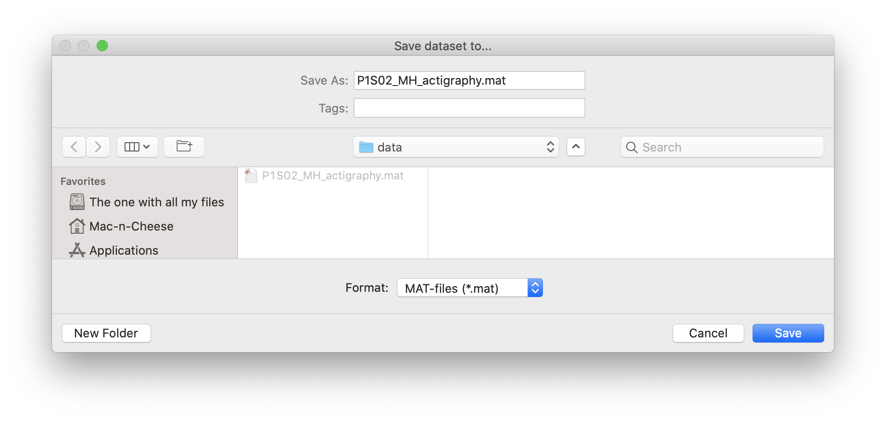
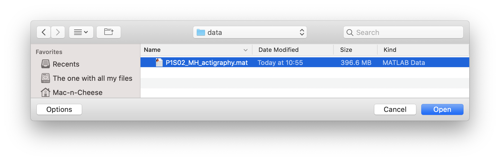

.. _file-save-open-dataset-top:

=======================
Save and Open a Dataset
=======================

**To save a Dataset (as),**

- click ``File`` > ``Save Dataset (As)``.

    A new browse window will open for you to specify the location and filename to save the Dataset to. Click 'Save' to save, or 'Cancel' to abort. 

.. note::

    If the filename and filepath is specified in Dataset and the user clicks ``File`` > ``Save Dataset``, the Dataset is immediately saved without prompt.

**To open an existing Dataset,**

- click ``File`` > ``Open Dataset``.

    A new browse window will open for you to select the .mat file to open. Navigate to your Dataset file, select it, and click 'Open'. Click 'Cancel' to abort.