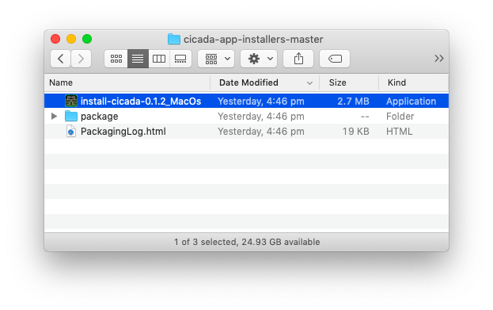
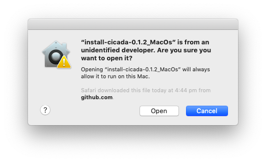
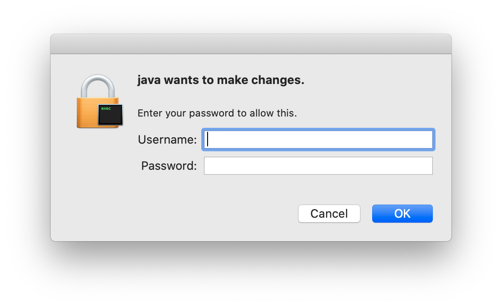
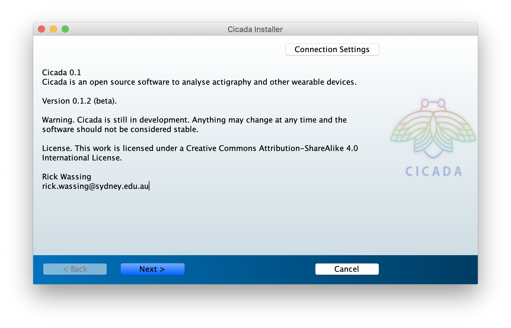
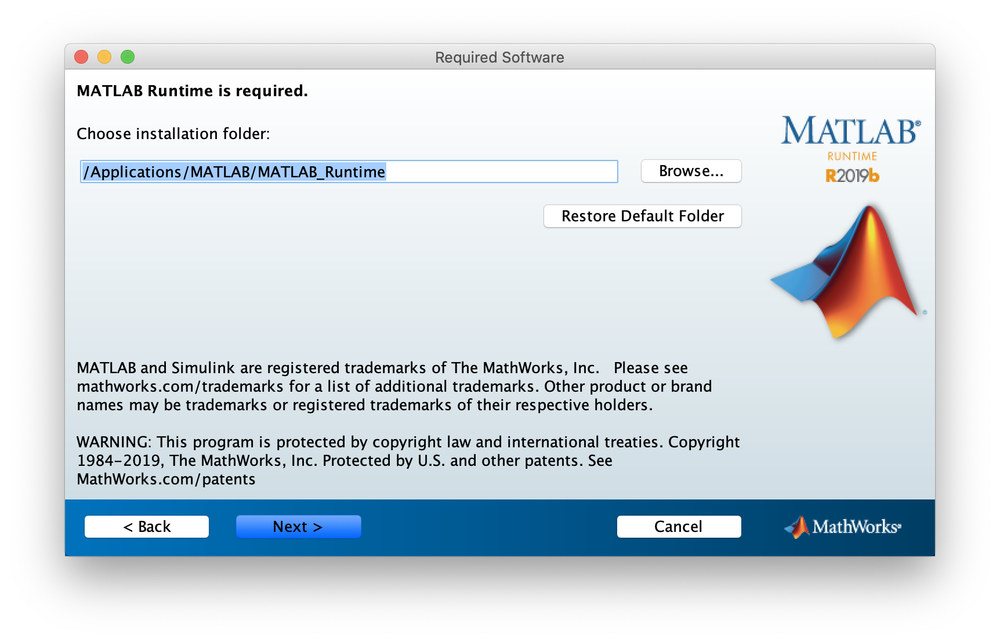
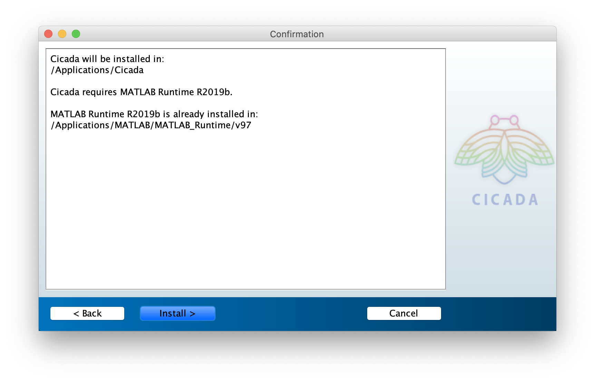
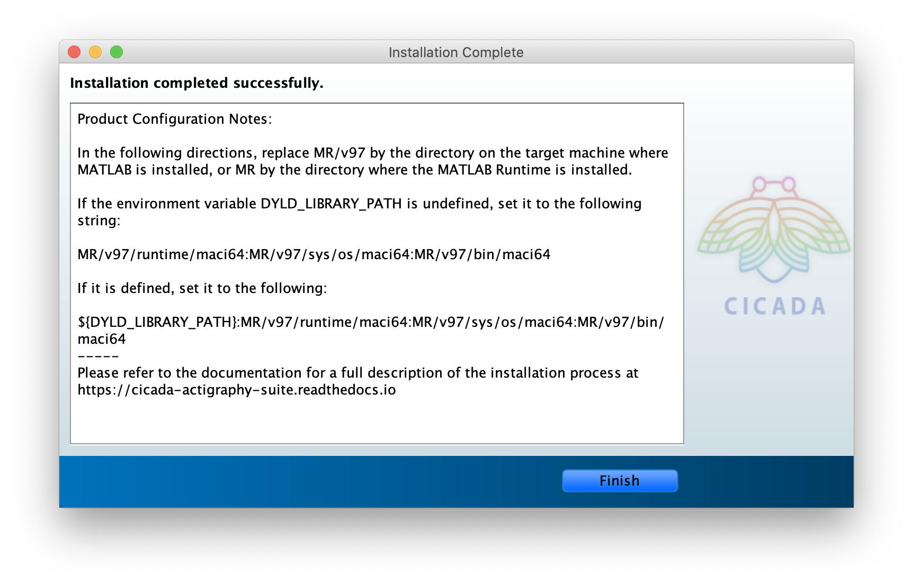

.. _installation-standalone-macos-top:

========================
Install Cicada for MacOS
========================

1. `Download <https://github.com/rickwassing/cicada-app-installers/archive/master.zip>`_ the Cicada App Installer.

2. Unzip and open the downloaded folder 'cicada-app-installers-master'.
3. Open the 'install-cicada-0.1.2_MacOs' App.

4. You may be prompted with the request to allow Java to make changes to your system. Enter your username and password for the Admin User on your Mac.

5. The installer will first download a Matlab Runtime Installer. Matlab Runtime is a free software that enables the execution of compiled Matlab applications, such as Cicada.

6. The Cicada Installer first shows the information about Cicada, click 'Next >'.

.. figure:: images/installation-standalone-macos-5.png
    :width: 862 px
    :align: center

7. Choose the installation folder, it is highly recommend to use the default installation location, or click 'Browse' to change the location. Then click 'Next >'.

8. Choose the installation folder for the Matlab Runtime Software, it is highly recommend to use the default installation location, or click 'Browse' to change the location. Then click 'Next >'.

9. The installer now shows an overview of all the installation settings. Click 'install >' to confirm.

10. If everything went well, the installer will show that the 'installation completed successfully'.

Start Cicada
============

You can either run Cicada from the Terminal, or if you want to run Cicada simply by opening the Cicada.app from the Finder window, then we need to tell your Mac where to find the Matlab Runtime Software.

Run Cicada using the Terminal
=============================

1. Open the 'Terminal' app, which is located in '/Applications/Utilities/Terminal'.
2. Change directory to the Cicada installation location by typing,

.. code-block::

    $ cd /Applications/Cicada/application

3. Start Cicada by running the 'run_Cicada.sh' script with the location of the Matlab Runtime Software as the first argument,

.. code-block::

    $ sh run_Cicada.sh /Applications/MATLAB/MATLAB_Runtime/v97

Run Cicada from the Finder Window
=================================

Before we can run Cicada from the Finder window, we need to tell your Mac where the Matlab Runtime Software is located.

Edit your bash settings file
----------------------------

1. Open the 'Terminal' app, which is located in '/Applications/Utilities/Terminal'.
2. Check whether the 'DYLD_LIBRARY_PATH' environment variable is defined by typing

.. code-block::

    $ echo $DYLD_LIBRARY_PATH

If the result is empty, it is undefined, otherwise it is defined.

3. There may be a hidden file called '.bash_profile' in your home folder, i.e. '/Users/[your-username]/.bash_profile'. Open this file in a plain text editor. If you can't see hidden files in the Finder window, press ``Command+Shift+Dot`` to show hidden files (and again to hide them). If this file does not exist, create a new empty plain-text file with the name '.bash_profile' (no extension).
4. If the environment variable was **undefined**, add this line to the file

.. code-block::

    export DYLD_LIBRARY_PATH=/Applications/MATLAB/MATLAB_Runtime/v97/runtime/maci64:/Applications/MATLAB/MATLAB_Runtime/v97/sys/os/maci64:/Applications/MATLAB/MATLAB_Runtime/v97/bin/maci64

5. If the environment variable was **defined**, add this line to the file

    export DYLD_LIBRARY_PATH=${DYLD_LIBRARY_PATH}:/Applications/MATLAB/MATLAB_Runtime/v97/runtime/maci64:/Applications/MATLAB/MATLAB_Runtime/v97/sys/os/maci64:/Applications/MATLAB/MATLAB_Runtime/v97/bin/maci64

6. Restart your Mac.
7. Start Cicada. Once you have specified the location of the Matlab Runtime Software, you can simply start Cicada from the Finder by navigating to /Applications/Cicada/application and open Cicada.app.