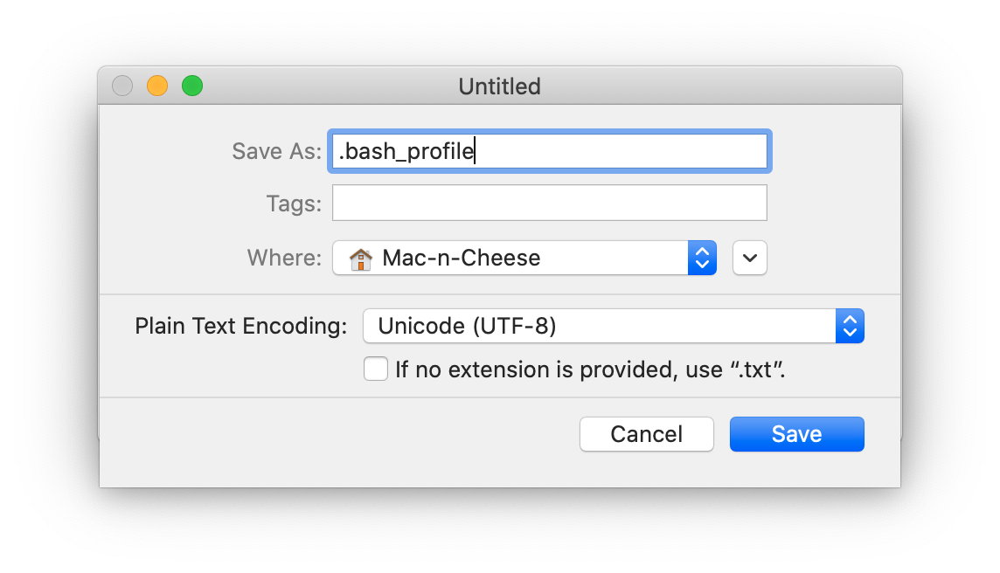
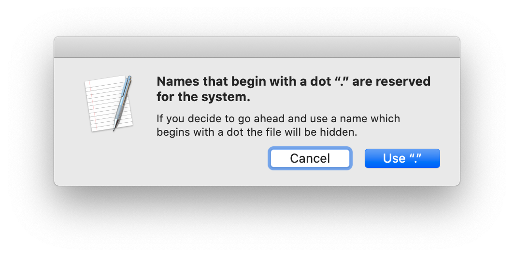

.. _installation-standalone-macos-top:

========================
Install Cicada for MacOS
========================

1. `Download <https://github.com/rickwassing/cicada-app-installers/archive/master.zip>`_ the Cicada App Installer.

.. figure:: images/installation-standalone-macos-1.png
    :width: 783px
    :align: center

2. Unzip and open the downloaded folder 'cicada-app-installers-master'.

3. Open the 'install-cicada-0.1.2_MacOs' App.

.. figure:: images/installation-standalone-macos-4.png
    :width: 862px
    :align: center

.. figure:: images/installation-standalone-macos-3.png
    :width: 552px
    :align: center

4. You may be prompted with the request to allow Java to make changes to your system. Enter your username and password for the Admin User on your Mac.

.. figure:: images/installation-standalone-macos-2.png
    :width: 555px
    :align: center

5. The installer will first download a Matlab Runtime Installer. Matlab Runtime is a free software that enables the execution of compiled Matlab applications, such as Cicada.

.. figure:: images/installation-standalone-macos-5.png
    :width: 862px
    :align: center

6. The Cicada Installer first shows the information about Cicada, click 'Next >'.

.. figure:: images/installation-standalone-macos-6.png
    :width: 862px
    :align: center

7. Choose the installation folder, it is highly recommend to use the default installation location, or click 'Browse' to change the location. Then click 'Next >'.

.. figure:: images/installation-standalone-macos-7.png
    :width: 862px
    :align: center

8. Choose the installation folder for the Matlab Runtime Software, it is highly recommend to use the default installation location, or click 'Browse' to change the location. Then click 'Next >'.

.. figure:: images/installation-standalone-macos-8.png
    :width: 862px
    :align: center

9. The installer now shows an overview of all the installation settings. Click 'Install >' to confirm.
10. If everything went well, the installer will show that the 'installation completed successfully'.

Start Cicada
============

You can either run Cicada from the Terminal, or if you want to run Cicada simply by opening the Cicada.app from the Finder window, then we need to tell your Mac where to find the Matlab Runtime Software.

Run Cicada using the Terminal
-----------------------------

1. Open the 'Terminal' app, which is located in '/Applications/Utilities/Terminal'.
2. Change directory to the Cicada installation location by typing,

.. code-block:: bash

    $ cd /Applications/Cicada/application

3. Start Cicada by running the ``run_Cicada.sh`` script with the location of the Matlab Runtime Software as the first argument,

.. code-block:: bash

    $ sh run_Cicada.sh /Applications/MATLAB/MATLAB_Runtime/v97

Run Cicada from the Finder Window
---------------------------------

We need to tell your Mac (just this once) where the Matlab Runtime Software is located. After we've done that, you can run Cicada directly from the Finder window.

1. Open the 'Terminal' app, which is located in '/Applications/Utilities/Terminal'.
2. Check whether the ``DYLD_LIBRARY_PATH`` environment variable is defined by typing

.. code-block:: bash

    $ echo $DYLD_LIBRARY_PATH

3. If the result is empty, it is **undefined** and we'll create that environment variable, otherwise it is **defined** and we'll append that variable.
4. This environment variable should be stored in a hidden file called '.bash_profile' in your home folder, i.e. '/Users/[your-username]/.bash_profile'. Use the Finder window to navigate to your home folder and use ``Command+Shift+Dot`` to toggle hidden files visible. If '.bash_profile' does not exist yet, continue to step 5, otherwise continue to step 9.
5. Open the 'TextEdit' app, and create a new empty document.
6. Click 'Format' > 'Make Plain Text' if this is not already a plain-text document.
7. Click 'File' > 'Save', and type ``.bash_profile`` in the 'Save As' field, and Select your home folder (indicated by the house icon) as the location. Make sure to un-tick the option 'if no extension is provided, use ".txt"'. Click 'Save'.

8. The following warning message appears, but that's ok, click 'Use "."'

9. If the environment variable was

    - **undefined**, add this line to the '.bash_profile' file

    .. code-block:: bash

        export DYLD_LIBRARY_PATH=/Applications/MATLAB/MATLAB_Runtime/v97/runtime/maci64:/Applications/MATLAB/MATLAB_Runtime/v97/sys/os/maci64:/Applications/MATLAB/MATLAB_Runtime/v97/bin/maci64

    - **defined**, add this line to the '.bash_profile' file

    .. code-block:: bash

        export DYLD_LIBRARY_PATH=${DYLD_LIBRARY_PATH}:/Applications/MATLAB/MATLAB_Runtime/v97/runtime/maci64:/Applications/MATLAB/MATLAB_Runtime/v97/sys/os/maci64:/Applications/MATLAB/MATLAB_Runtime/v97/bin/maci64

10. Save the '.bash_profile' file and restart your Mac.
11. Start Cicada. Once you have specified the location of the Matlab Runtime Software, you can simply start Cicada from the Finder by navigating to '/Applications/Cicada/application' and open 'Cicada.app'.