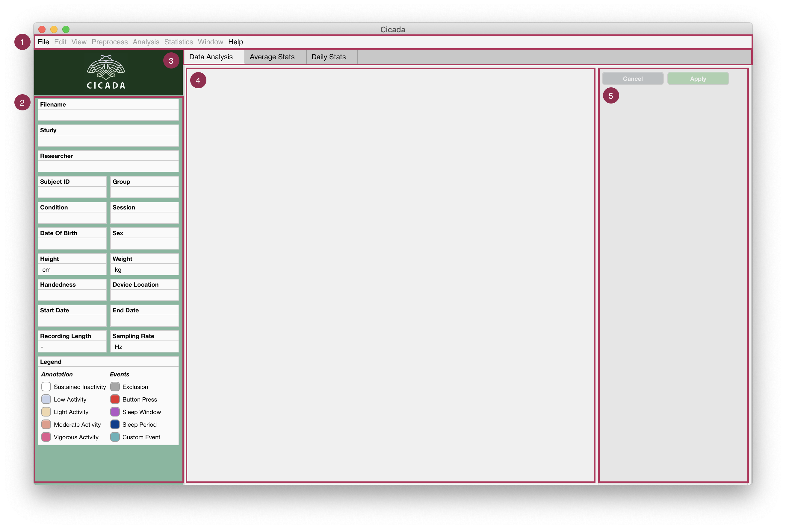

.. _overview-interface-top:

=========================
The Cicada User Interface
=========================

The Cicada User Interface is made up of 5 main sections

1. **Menu bar.**
    - The 'File' menu concerns everything about loading and saving workspaces; importing data and events; exporting the calculated statistics, reports and Matlab code; and to close the current workspace or quit the program.
    - The 'Edit' menu concerns everything about changing the dataset information regarding the study, participant and recording; to change the recording time; and set the epoch length.
    - The 'View' menu allows to to switch the metric used to display the accelerometer data.
    - The 'Preprocess' menu concern all data processing steps that may be necessary before analysing the data.
    - The 'Analysis' menu allows you to annotate each epoch according to some thresholding method, or to define events. Either way, the labels of these annotated epochs/events are used to select those parts of the data for calculating statistics.
    - The 'Statistics' menu allows you to calculate average and daily statistics, and if defined, to also calulate statistics over sleep and custom events.
    - The 'Window' menu is used as a patch for an open issue (`#4 on GitHub <https://github.com/rickwassing/cicada-develop/issues>`_). Whenever data panels are mispositioned, use this menu to realign them.
    - The 'Help' menu shows information about the software, the author, and the associated license, and provides a link to these documents.
2. **The Information Panel.** Shows all the information regarding the study, participant and recording.
3. **Tab Group.**
    - The 'Data Analysis' tab shows all of the epoched metrics in the current dataset.
    - The 'Average Stats' tab shows the statistics which are averaged across the entire recording.
    - The 'Daily Stats' tab shows the statistics for each day in the recording.
    - Additional tabs are shown, when applicable, to show statistics for sleep or custom events.
4. **Main Data Analyis Panel.** Shows all of the epoched metrics for each of the available datatypes (e.g. acceleration, light, temperature) in each analysis window.
5. **Settings Panel.** Allows the user to change the analysis window, change how the data is displayed, and delete entire groups of annotation and events with the same label.

