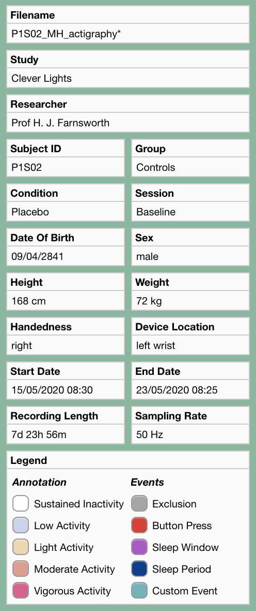
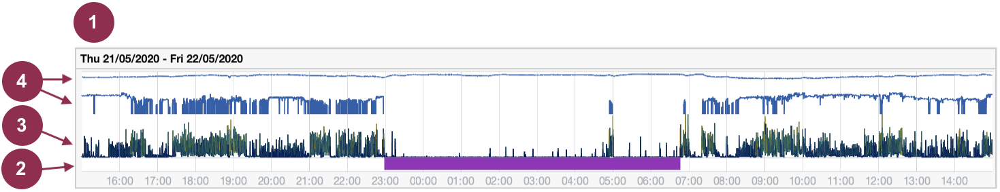
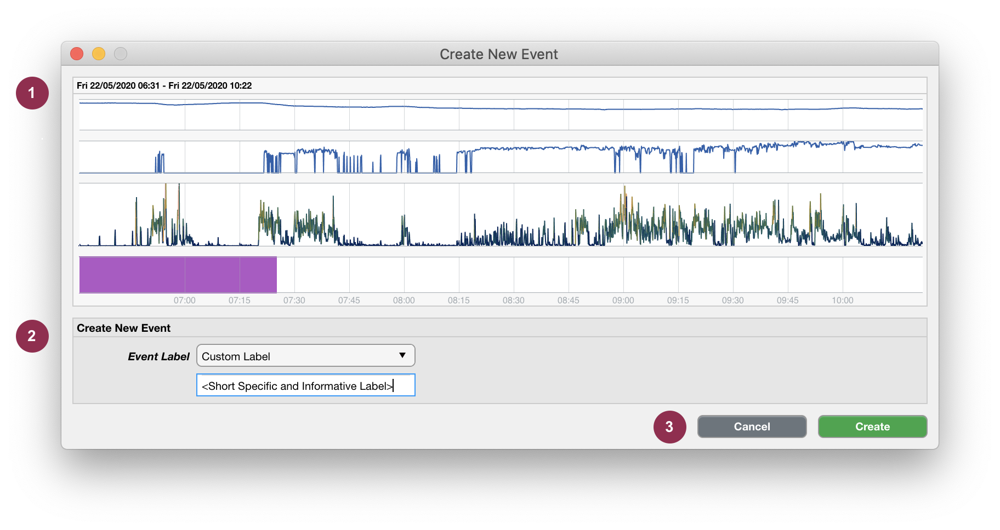
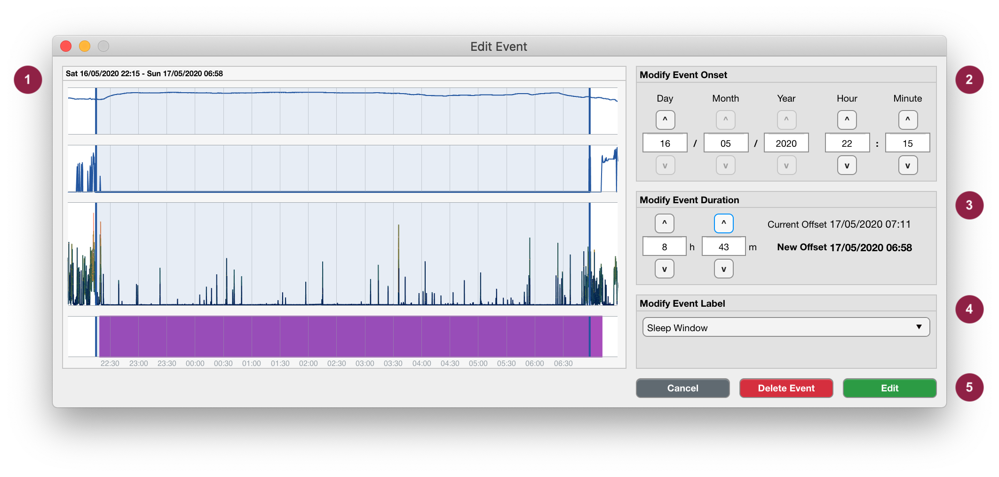
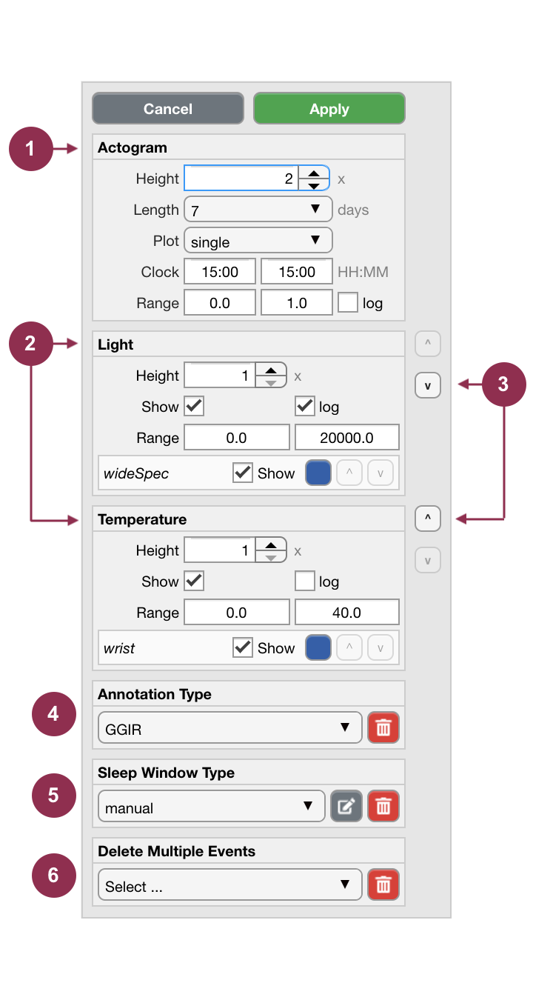

.. _overview-interface-top:

=========================
The Cicada User Interface
=========================

.. figure:: images/overview-interface-1.png
    :align: center
    :width: 1312px

    **The Cicada User Interface is made up of 5 main sections.**

1. **Menu bar.**
    - The 'File' menu concerns everything about loading and saving Datasets; importing Raw Data and Events; exporting Statistics, reports and Matlab code; and to close the Dataset or quit the program.
    - The 'Edit' menu concerns everything about changing information regarding the study, participant and recording; to change the recording time; and set the Epoch length.
    - The 'View' menu is used to switch which Metric is displayed as the Acceleration Metric.
    - The 'Preprocess' menu concerns all Data processing steps that may be necessary before Analysis.
    - The 'Analysis' menu lists all options to Annotate each Epoch according to some thresholding method, or to define Events. Either way, the labels of these Annotated Epochs/Events are used to select segments of the Dataset for calculating Statistics.
    - The 'Statistics' menu calculates average and daily Statistics, and if applicable, also calculates Statistics for Sleep Window Events and Custom Events.
    - The 'Window' menu is used as a patch for an open issue (`#4 on GitHub <https://github.com/rickwassing/cicada-develop/issues>`_). Whenever data panels are mispositioned, use this menu to realign them.
    - The 'Help' menu shows information about the software, the author, and the associated license, and provides a link to these documents.
2. **Information Panel.** Shows all the information regarding the study, participant and recording (see :ref:`below <overview-interface-information-panel>`).
3. **Tab Group.**
    - The 'Data Analysis' tab shows all Epoched Metrics, Events and Annotation in the current dataset.
    - The 'Average Stats' tab shows the Statistics averaged across the entire recording.
    - The 'Daily Stats' tab shows the Statistics for each day in the recording.
    - More tabs are shown, if applicable, to show Statistics for Sleep Window Events or Custom Events.
4. **Data Analyis Tab and Panels.** Shows all Epoched Metrics, Events and Annotation for each of the available Data types (e.g. Acceleration, light and temperature), in one panel for each single or double day segment in the recording (see :ref:`below <overview-interface-data-analysis-tab>`).
5. **Settings Panel.** To change the analysis window, change how the Epoched Metrics are displayed, and delete groups of Annotation types or Events with the same label (see :ref:`below <overview-interface-settings-panel>`).

.. _overview-interface-information-panel:

Information Panel
=================

    
    **Information panel.** The asterisk (*) at the end of the filename indicates that the file is currently not saved. I trust that the rest speaks for itself and does not require further explanation.

.. _overview-interface-data-analysis-tab:

Data Analysis Tab and Panels
============================

The data is partitioned into single or double day segments according to the details in the settings panel (see :ref:`below <overview-interface-settings-panel>`). Each panel displays the Epoched Metrics for each segment.

    
    **Example data panel.** (1) The title of the panel shows the start and end date of the displayed data segment, in this example '21/05/2020 15:00' until '22/05/2020 15:00'. There are 4 axes in this data panel. One for the events (2), which shows a Sleep Window Event (purple bar); and three additional axes for each data type in this recording. This recording was made with an ActivInsights GeneActiv watch, which measures Acceleration, light exposure and temperature. The Acceleration is shown in axes (3), and the light and temperature timeseries are shown in the axes identified by (4).

.. _overview-interface-create-events:

Interact with the interface to create events
--------------------------------------------

You can interact with the user interface by the use of your mouse cursor, and a few keyboard keys. The purpose of this is to create events with predefined or custom event labels. For each of these event labels, Cicada will select those data segments for calculating statistics (except for Reject Events of course).

1. Left-click anywhere within the data panel to indicate the **onset** or **offset** of the event. A pink cursor will appear with a label showing the time in ``HH:MM``.
2. Optionally, adjust the location of the cursor by pressing the ``left`` or ``right arrow`` keys on your keyboard.
3. Lock-in this timepoint by pressing the ``enter`` key. The cursor will now appear in blue color.
4. Again, left-click anywhere within the data panel and adjust using the ``arrow`` keys. If this second timepoint (pink) is *after* the first timepoint (blue) then the first timepoint marks the event **onset** and the second marks the event **offset**; and *vice versa*.
5. If you're unhappy about your selection
    - press the ``escape`` or ``backspace`` key on your keyboard, all cursors will disappear, go to step 1.
6. If you're happy about your selection
    - Press the ``enter`` key, the selection will now appear as a blue rectangle.
7. The following interface will appear

    
    **Create New Event.** The portion of the data that you selected is shown as a blue box in panel (1). Use panels (2) and (3) to adjust the onset and duration of the to-be-created Event. Use panel (4) to label the new Event, i.e. select a pre-existing event label from the dropdown list, or specify a new custom event label. To create the event, press ``Create``, or use the ``Cancel`` button to abort (5).

.. note::

    This selection tool may also be useful to inspect the data. Use the cursors to select part of the data, and this user interface will show the zoomed-in details of that data segment.

.. _overview-interface-edit-events:

Edit events
-----------

To manually edit an event, left-click on the event of interest in the data analysis panel.

.. note::

    Events that are of type ``manual``, ``reject`` or ``customEvent`` can be manually edited. Events that are created by algorithms or are imported from files have a different event type, and cannot be edited manually. The reason for this is to maintain the original data integrity and to ensure repeatability of analysis pipelines. To edit an event created by an algorithm or imported from file, use the appropriate ``edit`` button to reassign the event type to ``manual`` (see :ref:`below <overview-interface-edit-sleep-window>`).

    **Edit Event**. Editing an Event is very similar to creating one. The light blue box in panel (1) shows the timepoints of the to-be-changed Event. Use panels (2), (3) and (4) to modify the onset, duration and label of the Event. To edit the Event, press ``Edit``; to remove the event from the Dataset, press ``Delete``; or use the ``Cancel`` button to abort (5)

.. warning::

    When you change the event onset, for example from ``07:30`` to ``08:00``, without changing the duration, the event offset will also be 30 minutes later. Similarly, if you change the duration of the event, for example from ``1h 0m`` to ``1h 30m``, without changing the onset, the event offset will also be 30 minutes later. Adjust both the event onset and duration accordingly if you wish to keep the event offset fixed. Note that the original event offset is shown for reference.

.. _overview-interface-settings-panel:

Settings Panel
==============

The settings panel lists all display options for each data type. In this example, these are 'Acceleration', 'light' and 'temperature'. The settings panel can also be used to delete groups of Annotation types and Events with the same label.

    
    **Settings Panel.** The display settings for each data type can be changed in panels identified by (1) and (2); which correspond to 'Acceleration', 'light' and 'temperature' in our example (see :ref:`below <overview-interface-display-settings>` for details). Change the order of the data axes with the '^' (up) and 'v' (down) buttons (3). If applicable, the Annotation of Epochs can be deleted in panel (4), the Sleep Windows can be manually edited or deleted in panel (5, see :ref:`below <overview-interface-edit-sleep-window>` for details), and entire groups of Events with the same label can be deleted in panel (6).

.. _overview-interface-display-settings:

Display Settings
----------------

- Actogram
    - The ``Height`` of the respective axes for each data type is relative to each other. In this example the acceleration axis is 2 times the height of the light and temperature axes.
    - The ``Length`` of the actogram determines the number of days that are displayed in one view, i.e. without scrolling.
    - The ``Plot`` dropdown menu determines whether a single or a double day is shown in each panel. Note that when viewing double days, the second day in the first panel is equal to the first day in the second panel, etc.
    - The ``Clock`` inputs set the start and end time for each data segment, i.e. horizontal axis. This is mainly used for display purposes only. However, currently, the only algorithm that depends on this setting is the :ref:`GGIR sleep detection algorithm <analysis-sleep-create-sleep-window-ggir>`.
    - The ``Range`` inputs sets the minimum and maximum limits of the vertical axis.
    - The ``Log`` check-box sets the scale of the vertical axis to 'linear' or 'logarithmic (base 10)'.
- Other data types, e.g. 'light' or 'temperature'
    - The ``Show`` check-boxes are used to show or hide the axes or single data traces.
    - The coloured ``buttons`` can be used to change the color of the data trace.
    - The ``^`` (up) and ``v`` (down) buttons can be used to reorder the data traces.

.. _overview-interface-edit-sleep-window:

Sleep Window Types
------------------

Sleep windows can be defined in various ways. Refer to the section on :ref:`sleep analysis <analysis-sleep-top>` for in-depth instructions. For example, the user may manually create sleep window events, import a sleep diary, or use the GGIR sleep detection algorithm to define sleep windows. While all of these events have the label ``sleepWindow``, their types differ (respectively ``manual``, ``sleepDiary`` and ``GGIR``). If there are multiple Sleep Window types, this panel must be used to select which type of Sleep Windows are used to calculate statistics. 

1. Select the appropriate Sleep Window type from the dropdown list, 
2. then click ``Apply`` for this setting to take effect.

Edit Sleep Windows created by algorithms or imported from a file
^^^^^^^^^^^^^^^^^^^^^^^^^^^^^^^^^^^^^^^^^^^^^^^^^^^^^^^^^^^^^^^^

Sleep window events that are created by algorithms or imported from a file cannot be manually edited directly. The reason for this is to maintain the original data integrity and to ensure repeatability of analysis pipelines. To edit a sleep window event created by an algorithm or imported from file,

1. first select the appropriate sleep window type from the dropdown menu, 
2. click ``apply``,
3. then click the ``edit`` button.

Cicada will now copy all sleep window events of this type reassign their type to ``manual`` sleep window events. These events can now be edited as described :ref:`before <overview-interface-edit-events>`.

.. _overview-interface-delete-annotation-type:

Delete Sleep Windows of a common type
^^^^^^^^^^^^^^^^^^^^^^^^^^^^^^^^^^^^^

When you want to delete the entire set of Sleep Window Events of the same type,

1. first select the appropriate Sleep Window type from the dropdown list, 
2. click ``apply``,
3. then press the ``delete`` button,
4. in the confirmation dialogue, press ``Yes, delete`` to confirm, or ``No, cancel`` to abort.

Delete Annotation Types
-----------------------

Different thresholding methods can be used to Annotate the various data types. Refer to the section on :ref:`Annotating Acceleration <analysis-annotate-acceleration-ggir-top>` and :ref:`Annotating Light <analysis-annotate-light-top>` for in-depth instructions. 

To delete Annotations of the same type, 

1. first select the appropriate Annotatation type from the dropdown list, 
2. then press the ``delete`` button,
3. in the confirmation dialogue, press ``Yes, delete`` to confirm, or ``No, cancel`` to abort.

Delete Multiple Events
----------------------

Single events can be deleted as described in the section on :ref:`editing Events <overview-interface-edit-events>`, but it may be more convenient to delete all events with the same label at once. To do so,

1. first select the appropriate Event label from the dropdown menu, 
2. then click the ``delete`` button,
3. in the confirmation dialogue, press ``Yes, delete`` to confirm, or ``No, cancel`` to abort.

Advanced users and contributors
-------------------------------

This section below if for advanced users only or for those who'd like to contribute to Cicada.

Cicada User Interface Management
^^^^^^^^^^^^^^^^^^^^^^^^^^^^^^^^

The Cicada user interface is comprised of various 'Components', e.g. ``uipannel``, ``uiaxes``, or ``plot`` objects (note that the terms 'Component' and 'Object' can be used interchangeably, but here I refer to them as Components). Each Component has properties, e.g. ``Position``, ``XLim``, or ``XData``, and their values are dictated by the data in the ``ACT`` structure. For example, the user can change the analysis window through the Cicada GUI and this will trigger the event function to update the ``ACT.startdate`` and ``ACT.enddate`` value. At the end of each event, the ``lifecycle()`` function is called, which is based on the lifecycle method of [`React, a JavaScript library for building user interfaces`_. The ``lifecycle()`` function is comprised of the following sequence of sub-functions:

.. _`React, a JavaScript library for building user interfaces`: https://reactjs.org

- **mapStateToProps(app)**. Maps the current state of the ``ACT`` data structure to 'mount', i.e. create, Components if they don't exist yet, or to create a copy of the relevant Component properties with updated values. Importantly, these properties are not updated here but later in the lifecycle. This construction of Components is processed by the ``app_construct*`` functions which contain the sub-functions ``shouldComponentMount()``, ``mountComponent()`` and ``constructComponent()`` (see below). For optimization purposes, only those Components that are a member of the component-groups in `app.ComponentList` are mapped.
- **app_construct[.](app, ~)**. This set of functions is organized by Component groups. For example, ``app_constructDataPanel()`` is responsible for constructing all the components in the main panel in the Data Analysis tab. For each of the required Components, the function ``shouldComponentMount()`` is called, which checks if the Component, identified by its ``Tag`` property, already exists or not. If not, the Component properties are constructed in a cell array called ``props``, and the function ``mountComponent()`` is called. If the Component exists, the relevant properties are constructed and the function ``constructComponent()`` is called.
- **shouldComponentMount(app, Parent, Tag)**. Uses the build-in Matlab function ``findobj()`` to find a Component identified by its unique Tag among the Children of the Parent Component. If the ``findobj()`` function returns empty, the Component does not exist yet, and should be mounted, otherwise it should be constructed.
- **mountComponent(app, mountFnc, Parent, Properties)**. Uses the build-in Matlab function ``eval()`` to call the mount function, specified as a string in ``mountFnc``. The mounting of Components is processed by the ``mount_*`` functions which take in the arguments ``app``, ``Parent``, and ``Properties``.
- **constructComponent(app, Tag, Parent, Properties)**. Creates ``app.Components`` which is a cell array of size <N-by-2> where the fist column contains the handle to the Component, and the second column contains the relevant properties and their updated values.
- **shouldComponentUpdate(app, Component, NewProps)**. Once the ``app.Components`` cell array is constructed for all relevant Component groups, a for-loop runs through all <N> elements. For each, ``shouldComponentUpdate()`` checks if the current Component property values are equal to the updated property values in ``app.Components``. Only if at least one property is different, the Component is updated by the function ``updateComponent()``.
- **updateComponent(app, Component, NewProps)**. Updates the property values of the Component.
- **unmountComponents(app)**. Finally, ``unmountComponents()`` checks for each Component in the relevant Component groups if the data in the ``ACT`` structure still requires a particular Component to exist. For example, if the user deletes an event, the graphical Component should be removed as well. The unmounting of Components is processed by ``unmountComponent()``.
- **unmountComponent(app, Component)**. Uses the build-in Matlab function ``delete()`` to unmount a Component.

Menu items and their call-alone functions
^^^^^^^^^^^^^^^^^^^^^^^^^^^^^^^^^^^^^^^^^

**File > Open Dataset**

.. code-block:: matlab

    ACT = cic_loadmat(fullpath);
    [ACT, err, msg] = cic_checkDataset(ACT);
    ACT = cic_calcEpochedMetrics(ACT, epoch); % Epoch length in seconds
    ACT = cic_getDays(ACT, analysisWinStart, analysisWinEnd); % e.g. '15:00', '15:00'

**File > Save Dataset (As)**

.. code-block:: matlab

    ACT = cic_savemat(ACT, fullpath);

**File > Import Data > Import GeneActiv (.bin)**

.. code-block:: matlab

    ACT = cic_importGeneActivBin(fullpath);
    ACT = cic_calcEpochedMetrics(ACT, epoch); % Epoch length in seconds
    ACT = cic_getDays(ACT, analysisWinStart, analysisWinEnd); % e.g. '15:00', '15:00'

**File > Import Events > Import Sleep Diary**

.. code-block:: matlab

    [ACT, rawSleepDiary] = cic_importSleepDiary(ACT, fullpath); % Path to tabular text file or spreadsheet
    [ACT, importSettings, err, msg] = cic_importSleepDiarySettings(ACT, fullpath); % Path to .JSON settings file
    [ACT, err, msg] = cic_parseSleepDiary(ACT, rawSleepDiary, importSettings);
    ACT = cic_diarySleepEvents(ACT); % Generate events in 'ACT.analysis.events' from sleep diary
    ACT = cic_actigraphySleepEvents(ACT); % Generate sleep period and waso events if annotation is available

**File > Export > Statistics**

.. code-block:: matlab

    ACT = cic_exportStatistics(ACT, fullpath); % Write the statistics in 'ACT.stats' to .CSV files

**File > Export > Report**

.. code-block:: matlab

    % Sorry, this part of Cicada has not been developed yet.

**File > Export > Matlab Code**

.. code-block:: matlab

    ACT = cic_writeHistory(ACT, fullpath); % Write history to .m Matlab script

**Edit > Dataset Info**

.. code-block:: matlab

    ACT = cic_editInformation(ACT, newInfo); % Structure with any number, name and type of fields

**Edit > Select Data**

.. code-block:: matlab

    ACT = cic_selectDatasetUsingTime(ACT, startDate, endDate); % Start and end date [datenum] to crop the dataset to
    ACT = cic_getDays(ACT, analysisWinStart, analysisWinEnd); % e.g. '15:00', '15:00'

**Edit > Change Time Zone**

.. code-block:: matlab

    ACT = cic_changeTimeZone(ACT, newTimeZone) % New time zone [string]
    ACT = cic_getDays(ACT, analysisWinStart, analysisWinEnd); % e.g. '15:00', '15:00'

**Edit > Change Epoch Length**

.. code-block:: matlab

    ACT = cic_calcEpochedMetrics(ACT, epoch); % New epoch length in seconds

**Preprocess > GGIR Automatic Calibration**

.. code-block:: matlab

    ACT = cic_ggirAutomaticCalibration(ACT);
    ACT = cic_calcEpochedMetrics(ACT, epoch); % Epoch length in seconds

**Preprocess > GGIR Non-Wear Detection**

.. code-block:: matlab

    [ACT, err] = cic_ggirDetectNonWear(ACT);

**Analysis > Annotate Epochs > GGIR Annotation**

.. code-block:: matlab

    ACT = cic_ggirAnnotation(ACT, params); % Parameters used in algorithm [struct]
    ACT = cic_actigraphySleepEvents(ACT); % Generate sleep period and waso events if sleep windows are available

**Analysis > Events > Create Daily Events**

.. code-block:: matlab

    ACT = cic_createDailyEvent(ACT, onset, duration, label); % Onset [string] in 'HH:MM', duration in hours, label [string]

**Analysis > Events > Create Relative Events**

.. code-block:: matlab

    ACT = cic_createRelativeEvent(ACT, ...
        ref, ... % [string] either 'onset' or 'offset'
        refLabel, ... % [string] label of reference events
        refType, ... % [string] type of reference events
        delay, ... % [double] delay of new events, value can be negative or positive
        duration, ... % [double] duration of new events
        newLabel); % [string] label of new events

**Analysis > Events > GGIR Sleep Detection**

.. code-block:: matlab

    ACT = cic_ggirSleepPeriodDetection(ACT);
    ACT = cic_actigraphySleepEvents(ACT); % Generate sleep period and waso events if annotation is available

**Statistics > Generate Statistics**

.. code-block:: matlab

    ACT = cic_statistics(ACT); % Calculate average, daily and sleep statistics
    ACT = cic_statistics(ACT, 'customEvent', eventLabel); % Calculate statistics for custom events
