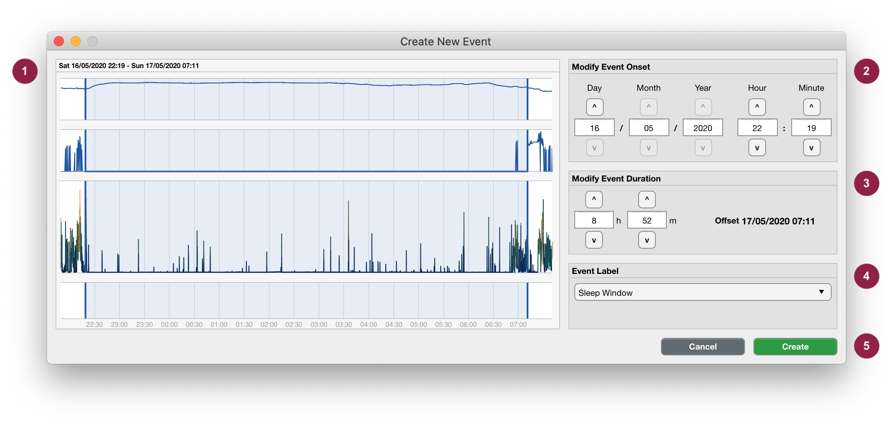

.. _overview-interface-top:

=========================
The Cicada User Interface
=========================

.. figure:: images/overview-interface-1.png
    :align: center
    :width: 656px

    **The Cicada User Interface is made up of 5 main sections.**

1. **Menu bar.**
    - The 'File' menu concerns everything about loading and saving workspaces; importing data and events; exporting the calculated statistics, reports and Matlab code; and to close the current workspace or quit the program.
    - The 'Edit' menu concerns everything about changing the dataset information regarding the study, participant and recording; to change the recording time; and set the epoch length.
    - The 'View' menu allows to to switch the metric used to display the accelerometer data.
    - The 'Preprocess' menu concern all data processing steps that may be necessary before analysing the data.
    - The 'Analysis' menu allows you to annotate each epoch according to some thresholding method, or to define events. Either way, the labels of these annotated epochs/events are used to select those parts of the data for calculating statistics.
    - The 'Statistics' menu allows you to calculate average and daily statistics, and if defined, to also calulate statistics over sleep and custom events.
    - The 'Window' menu is used as a patch for an open issue (`#4 on GitHub <https://github.com/rickwassing/cicada-develop/issues>`_). Whenever data panels are mispositioned, use this menu to realign them.
    - The 'Help' menu shows information about the software, the author, and the associated license, and provides a link to these documents.
2. **Information Panel.** Shows all the information regarding the study, participant and recording.
3. **Tab Group.**
    - The 'Data Analysis' tab shows all of the epoched metrics in the current dataset.
    - The 'Average Stats' tab shows the statistics which are averaged across the entire recording.
    - The 'Daily Stats' tab shows the statistics for each day in the recording.
    - Additional tabs are shown, when applicable, to show statistics for sleep or custom events.
4. **Data Analyis Tab and Panels.** Shows all of the epoched metrics for each of the available datatypes (e.g. acceleration, light, temperature) in each analysis window.
5. **Settings Panel.** Allows the user to change the analysis window, change how the data is displayed, and delete entire groups of annotation and events with the same label.

.. _overview-interface-information-panel:

Information Panel
=================

.. figure:: images/overview-interface-2.png
    :align: center
    :width: 248px
    
    **Information panel.** The asterisk (*) at the end of the filename indicates that the file is currently not saved. I trust that the rest speaks for itself and does not require further expanation.

.. _overview-interface-data-analysis-tab:

Data Analysis Tab and Panels
============================

The data is segmented into 24h or 48h partitions and the data for each partition is displayed in a panel.

.. figure:: images/overview-interface-3.png
    :align: center
    :width: 735px
    
    **Example data panel.** (1) The title of the panel shows the start and end date of the displayed data segment. There are 4 axes in this data panel. One for the events (2), which shows a sleep window event; and three additional axes for each data type in this recording. This recording was made with an ActivInsights GeneActiv watch, which measures acceleration, light exposure and temperature. The acceleration is shown in axes (3), and the light and temperature timeseries are shown in the axes identified by (4).

Interact with the data to create events
---------------------------------------

You can interact with the data panel by the use of your mouse cursor, and a few keyboard keys. The purpose of this interaction is for you to create events. 

1. Left-click anywhere within the data panel to indicate the **onset** or **offset** of the event. A pink cursor will appear with a label showing the time in ``HH:MM``.
2. Optionally, adjust the location of the cursor by pressing the ``left`` or ``right arrow`` keys on your keyboard.
3. Lock-in this timepoint by pressing the ``enter`` key. The cursor will now appear in blue color.
4. Left-click anywhere within the data panel, a pink cursor will appear, and again, adjust using the ``arrow`` keys. If this second time point (pink) is *after* the first timepoint (blue) then the first timepoint marks the event **onset** and the second marks the event **offset**; and *vice versa*.
5. When you're unhappy about your selection
    - press the ``escape`` or ``backspace`` key on your keyboard, all cursors will disappear, go to step 1.
6. When you're happy about your selection
    - Press the ``enter`` key, the selection will now appear as a blue rectangle.
7. The following interface will appear

    
    **Create New Event.** (1) The portion of the data that you selected is shown in the top panel. (2) Each event has a label, select a pre-existing event label from the dropdown list, or specify a new custom event label. (3) To create the event, press ``Create``, or use the ``Cancel`` button to abort.

.. note::

    This selection tool may also be useful to inspect the data. Use the cursors to select part of the data, and this user interface will show the details of that data segment.

.. _overview-interface-edit-events:

Edit events
-----------

To manually edit an event, click on the event of interest in the data analysis panel.

.. note::

    Events that are of type ``manual``, ``reject`` or ``customEvent`` can be manually editted. Events that are created by algorithms or are imported from files have a different event type, and cannot be manually editted. The reason for this is to enable repeatability of analysis pipelines. To edit an event created by an algorithm or imported from file, use the appropriate ``edit`` button to reassign the event type to ``manual``.

    **Edit Event**. You can edit the event label, its onset and duration. (1) Use the dropdown menu to reassign an event label, or select ``Custom Label`` to specify your own short, specific and informative event label. (2) Change the onset of the event. (3) Change the duration of the event. (4) You can delete this single event by using the ``Delete`` button, or confirm any changes with the ``Edit`` button, or abort with ``Cancel``.

.. warning::
    When you change the event onset, for example from ``07:30`` to ``08:00``, the event offset will also be 30 minutes later. Similarly, if you change the duration of the event, for example from ``1h 0m`` to ``1h 30m``, the event offset will also be 30 minutes later. Adjust both the event onset and duration accordingly to keep the event offset fixed.

.. _overview-interface-settings-panel:

Settings Panel
==============

The data is segmented into 24h or 48h partitions and the data for each partition is displayed in a panel.

.. figure:: images/overview-interface-6.png
    :align: center
    :width: 360px
    
    **Settings Panel.** The display settings for each data type can be changed in panels identified by (1) and (2); which correspond to acceleration, light and temperature in our example (See :ref:`below <overview-interface-display-settings>` for details). Change the order of the data axes with the `^` (up) and `v` (down) buttons (3). When applicable, the annotation of epochs can be deleted in panel (4), the sleep windows can be manually edited or deleted in panel (5, see :ref:`below <overview-interface-edit-sleep-window>` for details), and entire groups of events with the same label can be deleted in panel (6).

.. _overview-interface-display-settings:

Display Settings
----------------

The ``height`` of their respective axes is relative to each other. In this example the acceleration axis is 2 times the height of the light and temperature axes. 

Panel (1) further shows the number of days that are displayed in one view (``length``), whether the actogram displays a single or a double day. Note that when viewing the double day, the second day in the first panel is equal to the first day in the second panel, etc. 

.. _overview-interface-edit-sleep-window:

Display Settings
----------------