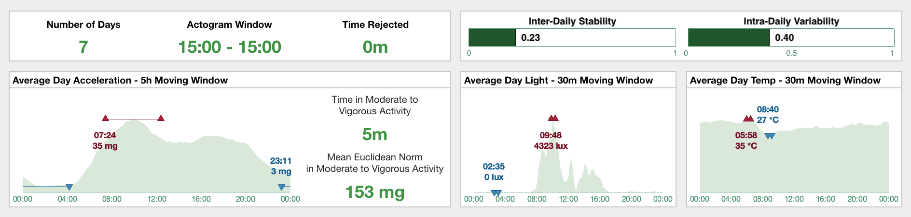
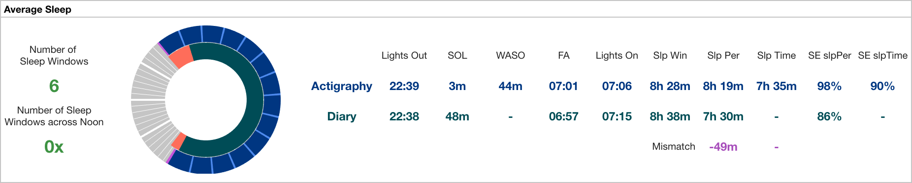
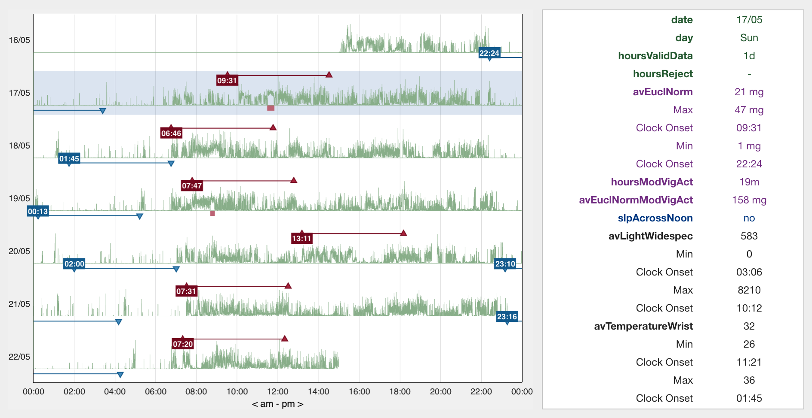
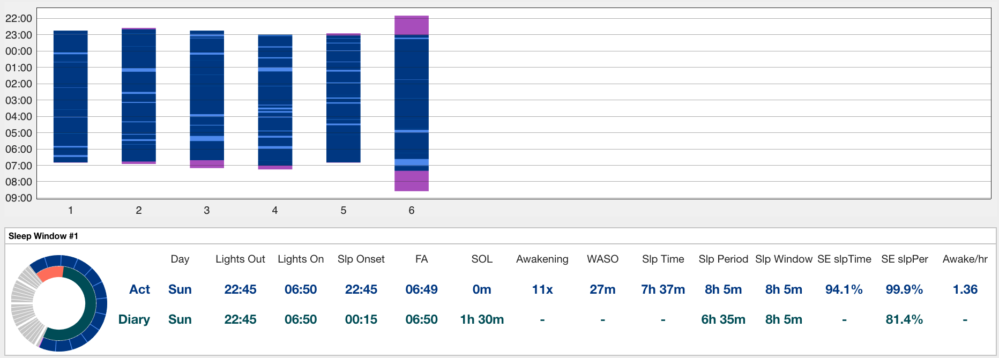
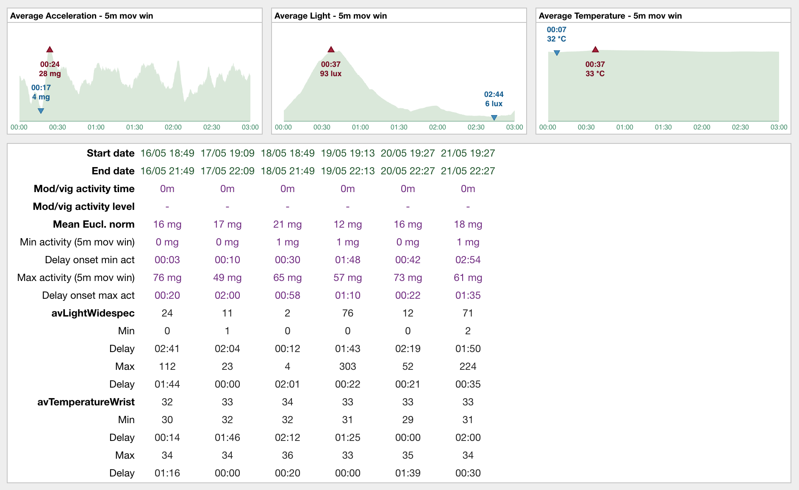
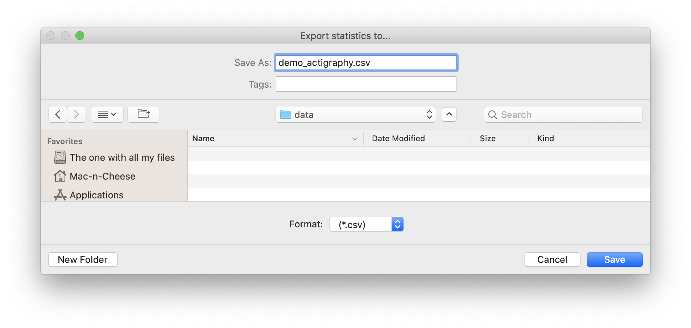

.. _statistics-top:

===================
Generate Statistics
===================

**This page provides the complete and in-depth outline of the generated statistics and the way they are calculated.**

We're almost done. So far, the following steps have been completed,

1. imported Raw Data or opened an existing Dataset, 
2. entered all relevant information about the Dataset, 
3. possibly cropped the Dataset and/or change the time zone,
4. preprocessed the Data to recalibrate or to indicate Reject segments,
5. Cicada calculated Metrics in a common timeframe,
6. each and every Epoch was Annotated,
7. Sleep Window Events were created based on manual scoring, a sleep diary or the GGIR algorithm,
8. and possibly created Custom Events (daily or relative) for time segments of interest.

The final step before we can export the results is to generate statistics. Cicada will calculate a predefined set of statistics averaged across the entire recording, for each day, for each Sleep Window, and for each Custom Event.

**To generate Statistics,**

- click ``Statistics`` > ``Generate Statistics``.

The results are shown in the respective Statistics tabs.

Average Stats
-------------

    **The average Statistics tab shows a subset of results averaged across the entire recording.**

In the top-left panel, you can see that the recording spanned across 7 days, that the analysis window is 15:00 to 15:00 the next day, and there are no Rejected segments, i.e. time is 0 minutes.

In the top-right panel, the inter-daily stability and intra-daily variability are shown. Intra-daily variability "quantifies the frequency and extent of transitions between periods of rest and activity" with higher values indicating more frequent or more extensive rest-activity transitions, whereas inter-daily stability "quantifies rhythm's synchronization to zeitgeber's 24h day–night [...] cycle" with higher values indicating stronger synchronization to the 24h rhythm (Gonçalves et al. 2014).

The Euclidean Norm, averaged across all days using a 5h moving window, is shown in the bottom-left panel titled "Average Day Acceleration". The graph shows clear distinction between activity during the night and daytime, with a peak in average activity in the morning. The onset and activity level in the 5h of *most* (M5; dark-red up-triagles) and *least* (L5; blue down-triangles) average activity are shown as well. Furthermore, on an average day, the participant spent 5m in moderate-to-vigorous activity, and at these times the mean activity level was 153 milli-g.

The next two-panels shows a similar graph but now for light and temerature Metrics averaged across all days using a 30m moving window. On the average day, the light exposure was strongest at 9:48 am with 4323 lux, etc.

.. note::

    **Reference:** Gonçalves, Bruno SB, et al. "Nonparametric methods in actigraphy: An update." Sleep Science 7.3 (2014): 158-164.

Average Sleep panel
^^^^^^^^^^^^^^^^^^^

    **If Cicada has access to at least one Sleep Window, the 'Average Sleep' is shown.**

The 'Average Sleep' panel shows all sleep Statistics averaged across all identified Sleep Windows and Sleep Periods of type ``actigraphy``. If Cicada also has access to Sleep Events of type ``sleepDiary``, it will show both sets of sleep Statistics for comparison. This allows inference of discrepancies between subjective and objective sleep Statistics.

In this example, there are 6 Sleep Windows, none of which cross 12:00 pm. Next, the clock diagram shows the average Sleep Window, Sleep Period and WASO events, of both types ``actigraphy`` and ``sleepDiary``. Please recall that the Sleep Windows are shown in purple, and Sleep Periods in blue, but to improve contrast for visualization, the ``sleepDiary`` Sleep Window is shown in orange, and its Sleep Period in teal. Finally, all average sleep Statistics are listed. See below for a description of how these Statistics are calculated.

.. note::

    - If no diary is imported, then Cicada only generates sleep Statistics for ``actigraphy`` sleep Events
    - If no Acceleration Annotation is available, then Cicada cannot define Actigraphy Sleep Period Events, and neither generate the sleep Statistics that depend on this Sleep Period
    - If the diary misses information on the Sleep Period or WASO, then Cicada cannot generate the sleep diary Statistics that depend on these Events, e.g. Sleep Time cannot be calculated without WASO
    - If Sleep Period and/or Sleep Time is available for both types ``actigraphy`` *and* ``sleepDiary``, then a mismatch score is calulated where a positive value indicates overestimation, and a negative value indicates underestimation
    - If at least one of the the Actigraphy Sleep Windows does not overlap with any of the diary Sleep Windows, or if there is a diffent number of Actigraphy and diary Sleep Windows, then Cicada cannot generate comparative average sleep Statistics, and only Actigraphy average sleep Statistics are generated

Daily Stats
-----------

    **The daily Statistics tab shows statistics for each day.**

The Euclidean Norm Metric is shown for each day in the recording on the left in the daily Statistics tab. In addition, the *most* (M5; dark-red up-triagles) and *least* (L5; blue down-triangles) activity periods are indicated along with the time of their onset. Furthermore, moderate-to-vigorous activity segments are indicated with red bars below the data traces. Left-click within the axes on any of the data traces to show all Statistics for that day in the right panel. See below for a description of how these Statistics are calculated.

Sleep Stats
-----------

    **If Cicada has access to at least one Sleep Window, the 'Sleep Stats' tab is shown.**

Sleep Statistics for each Sleep Window is shown in the sleep Statistics tab. The ``actigraphy`` Sleep Windows, Periods and WASO events are shown in the top panel. Next, a detailed overview of all sleep Statistics for each Sleep Window is shown in a separate panel. Again, if Cicada also has access to Sleep Events of type ``sleepDiary``, it will show both sets of sleep Statistics for comparison.

Custom Stats
------------

    **Statistics for each unique Custom Event label.**

For each set of Custom Events with the same label, Cicada calculates the average Acceleration (Euclidean Norm), and average Metrics from other available data types across all Events using 5m moving windows (top panels), which are then used to find the maximum (dark-red up-triagles) and minimum (blue down-triangles) values and their onset relative to the start of the Events (delay). This example shows relative Events referenced to 3h and 30m before the onset of each Sleep Window with a duration of 3h, i.e. 'presleep activity'. Whereas the average Acceleration and temperature does not seem to have a particular trend, the average light Metric shows that, on average, the particant was exposed 93 lux of light about 2h 30m before the onset of the Sleep Window, and to very low levels of light up to 1h 30m before the onset of the Sleep Window. Finally, the bottom panel shows all Statistics for each Custom Event in the set.

=====================
Statistics Definition
=====================

Definition of average Statistics
--------------------------------

.. note::

    Average statistics are calculated across all days in the recording, *and* also across all week- and weekend days in the recording.

- **avEuclNorm**. The grand-average of the Euclidean Norm, excluding rejected segments.
- **hoursReject**. Total sum of the duration of all Reject Events.
- **interDailyStability**. The frequency and extent of transitions between periods of rest and activity, calculated as ``sum((euclNormPerHr - avEuclNorm)^2) * nSamples / sum((euclNorm - avEuclNorm)^2) * nSamples``
- **intraDailyVariability**. Activity level synchronization to zeitgeber's 24h day–night cycle, calculated as ``sum(diff(euclNorm)^2) * nSamples / sum((avEuclNorm - euclNorm)^2) * (nSamples-1)``.
- **[min/max]EuclNormMovWin5h**. The mimumum/maximum average Euclidean Norm across all days using a 5h moving window.
- **clockOnset[Min/Max]EuclNormMovWin5h**. The clock onset of the minimum/maximum 5h of averaged Euclidean Norm across all days.
- **hoursModVigAct**. Average number of hours per day spend in moderate-to-vigorous activity.
- **avEuclNormModVigAct**. Average Euclidean Norm during segments of moderate-to-vigorous activity.
- **av(DataType)(Metric)**. The grand-average of the datatype's Metric (e.g. Temperature Wrist), excluding rejected segments.
- **[min/max](DataType)(Metric)MovWin30m**. The mimumum/maximum average Metric across all days using a 30m moving window.
- **clockOnset[Min/Max](DataType)(Metric)MovWin30m**. The clock onset of the minimum/maximum 30m of averaged Metric across all days.
- **hours(AnnotationLevel)(Metric)**. Average number of hours per day spent in this Annotation level for this Metric, e.g. ``hoursDimLight`` indicate the average number of hours spent in dim light per day.
- **slpCount**. Number of Sleep Windows in the recording.
- **slpAcrossNoon**. Number of Sleep Windows to overlap with 12:00 pm in the recording.
- **avClockLightsOut[Act/Diary]**. Average clock time of the the Sleep Window onsets (``Lights Out``) of type Actigraphy or Diary.
- **avClockLightsOn[Act/Diary]**. Average clock time of the Sleep Window offsets (``Lights On``) of type Actigraphy or Diary.
- **avClockSlpOnset[Act/Diary]**. Average clock time of the Sleep Period onsets of type Actigraphy or Diary. The Actigraphy Sleep Period onset corresponds to the first epoch Annotated as ``sustained inactive`` within the Sleep Window. The Diary Sleep Period onset corresponds to ``Lights Out`` + ``Sleep Onset Latency``.
- **avClockFinAwake[Act/Diary]**. Average clock time of the Sleep Period offsets of type Actigraphy or Diary. The Actigraphy Sleep Period onset corresponds to the last epoch Annotated as ``sustained inactive`` within the Sleep Window. The Diary Sleep Period onset corresponds to the ``Final awakening`` clock time.
- **avSlpOnsetLat[Act/Diary]**. Average duration in minutes between the onsets of the Sleep Window and Sleep Period, i.e. ``Sleep Onset`` - ``Lights Out``.
- **avAwakening[Act/Diary]**. Average number of awakenings within the Sleep Periods. The Actigraphy number of awakenings are the number of segments *not* Annotated as ``sustained inactive`` during the Sleep Periods. The Diary number of awakenings correspond to the estamated ``Awakenings``.
- **avWakeAfterSlpOnset[Act/Diary]**. The average duration of awakenings within the Sleep Periods in minutes. The Actigraphy WASO is the sum of the duration of the segments *not* Annotated as ``sustained inactive``, averaged across all Sleep Periods. The Diary WASO is the average ``WASO`` estimate across all Sleep Periods.
- **avSlpWindow[Act/Diary]**. The average duration of the Sleep Windows in minutes, i.e. ``avClockLightsOn - avClockLightsOut``.
- **avSlpPeriod[Act/Diary]**. The average duration of the Sleep Periods in minutes, i.e. ``avClockFinAwake - avClockSlpOnset``.
- **avTotSlpTime[Act/Diary]**. The average total sleep time in minutes calculated as ``avSlpPeriod - avWakeAfterSlpOnset``.
- **avSlpEffSlpTime[Act/Diary]**. The average sleep efficiency calculated as ``100 * avTotSlpTime / avSlpWindow``.
- **avSlpEffSlpPeriod[Act/Diary]**. The average sleep efficiency calculated as ``100 * avSlpPeriod / avSlpWindow``.
- **avAwakePerHour[Act/Diary]**. The average number of awakenings per hour spend in the Sleep Period, calculated as ``60 * avAwakening / avSlpPeriod``.
- **avSleepTimeMismatch**. Difference between the average total sleep time estimates from Diary and Actigraphy, i.e. ``avTotSlpTimeDiary - avTotSlpTimeAct``.
- **avSleepPeriodMismatch**. Difference between the average Sleep Period estimates from Diary and Actigraphy i.e. ``avSlpPeriodDiary - avSlpPeriodAct``.

Definition of Daily Statistics
------------------------------

- **date**. Date of the day (midnight to midnight) for which the Statistics are calculated
- **day**. Day of the week.
- **hoursValidData**. Total number of hours with valid data on this day.
- **hoursReject**. Total sum of the duration of all Reject Events on this day.
- **avEuclNorm**. This day's grand-average of the Euclidean Norm, excluding rejected segments.
- **[min/max]EuclNormMovWin5h**. The mimumum/maximum average Euclidean Norm for this day using a 5h moving window.
- **clockOnset[Min/Max]EuclNormMovWin5h**. The clock onset of the minimum/maximum 5h of averaged Euclidean Norm for this day.
- **hoursModVigAct**. Number of hours spend in moderate-to-vigorous activity on this day.
- **avEuclNormModVigAct**. Average Euclidean Norm during segments of moderate-to-vigorous activity on this day.
- **av(DataType)(Metric)**. This day's grand-average of the datatype's Metric (e.g. Temperature Wrist), excluding rejected segments.
- **[min/max](DataType)(Metric)MovWin30m**. The mimumum/maximum average Metric for this day using a 30m moving window.
- **clockOnset[Min/Max](DataType)(Metric)MovWin30m**. The clock onset of the minimum/maximum 30m of averaged Metric for this DataType on this day.
- **hours(AnnotationLevel)(Metric)**. Average number of hours spent in this Annotation level for this Metric on this day, e.g. ``hoursDimLight`` indicate the average number of hours spent in dim light per day.
- **slpAcrossNoon**. Boolean indicator whether this day's Sleep Window overlaps with 12:00 pm.

Definition of Sleep Statistics
------------------------------

- **slpCount**. Counter indicating this Sleep Window's index.
- **eventOrigin**. The origin of the Sleep Windows, ``manual``, ``sleepDiary`` or ``GGIR``.
- **day**. The day of the week of ``Lights On``, i.e. the day when this Sleep Window ended.
- **clockLightsOut**. Date and clock time of ``Lights Out``, start of the Sleep Window.
- **clockLightsOn**. Date and clock time of ``Lights On``, end of the Sleep Window.
- **clockSlpOnset**. Date and clock time of ``Sleep Onset``, start of the Sleep Period.
- **clockFinAwake**. Date and clock time of ``Final Awakening``, end of the Sleep Period.
- **slpOnsetLat**. Duration in minutes between the onset of the Sleep Window and Sleep Period, i.e. ``Sleep Onset`` - ``Lights Out``.
- **nAwakening**. Number of awakenings within the Sleep Period. The Actigraphy number of awakenings are the number of segments *not* Annotated as ``sustained inactive`` during the Sleep Periods. The Diary number of awakenings correspond to the estamated ``Awakenings``.
- **wakeAfterSlpOnset**. Duration of awakenings within the Sleep Period in minutes. The Actigraphy WASO is the sum of the duration of the segments *not* Annotated as ``sustained inactive``. The Diary WASO is the average ``WASO`` estimate.
- **slpWindow**. Duration of the Sleep Window in minutes, i.e. ``clockLightsOn - clockLightsOut``.
- **slpPeriod**. Duration of the Sleep Period in minutes, i.e. ``clockFinAwake - clockSlpOnset``.
- **totSlpTime**. Total sleep time in minutes calculated as ``slpPeriod - wakeAfterSlpOnset``.
- **slpEffSlpTime**. Sleep efficiency calculated as ``100 * totSlpTime / slpWindow``.
- **slpEffSlpPeriod**. Sleep efficiency calculated as ``100 * slpPeriod / slpWindow``.
- **awakePerHour**. The number of awakenings per hour spend in the Sleep Period, calculated as ``60 * nAwakening / slpPeriod``.

Definition of Custom Statistics
-------------------------------

- **onset**. Date and clock time of the Custom Event onset.
- **offset**. Date and clock time of the Custom Event offset.
- **avEuclNorm-**. Grand-average of the Euclidean Norm, excluding rejected segments during this Custom Event.
- **hoursModVigAct**. Number of hours spend in moderate-to-vigorous activity within this Custom Event.
- **avEuclNormModVigAct**. Average Euclidean Norm during segments of moderate-to-vigorous activity within this Custom Event.
- **[min/max]EuclNormMovWin5m**. The mimumum/maximum average Euclidean Norm during this Custom Event using a 5m (minute) moving window.
- **delayOnset[Min/Max]EuclNormMovWin5m**. The delay of the onset in 'HH:MM' of the minimum/maximum 5m of averaged Euclidean Norm relative to the onset of this Custom Event.
- **av(DataType)(Metric)**. The grand-average of the datatype's Metric (e.g. Temperature Wrist), excluding rejected segments during this Custom Event.
- **[min/max](DataType)(Metric)MovWin5m**. The mimumum/maximum average Metric aduring this Custom Event using a 5m moving window.
- **delayOnset[Min/Max](DataType)(Metric)MovWin5m**. The delay of the onset in 'HH:MM' of the minimum/maximum 5m of averaged Metric relative to the onset of this Custom Event.
- **hours(AnnotationLevel)(Metric)**. Average number of hours spent in this Annotation level for this Metric during this Custom Event, e.g. ``hoursDimLight`` indicate the average number of hours spent in dim light.

=================
Export Statistics
=================

**To export all Statistics,**

- click ``File`` > ``Export`` > ``Statistics``.

    A new browse window will open for you to specify the location and filename to save the Statistics to. Click 'Save' to save, or 'Cancel' to abort.

.. note::

    The Statistics are saved as a comma-separated-values (.CSV) files, one for each category of Statistics. The filename you specified using the browse window will be appended with the following name-value pairs. Average Statistics will be saved to ``[fname]_average-all.csv``, ``[fname]_average-week.csv`` and ``[fname]_average-weekend.csv``. Dialy Statistics will be saved to ``[fname]_daily.csv``. Sleep Statistics to ``[fname]_sleep-actigraphy.csv`` and ``[fname]_average-sleepdiary.csv`` if available. Custom Statistics to ``[fname]_custom-[customEventLabel].csv``.